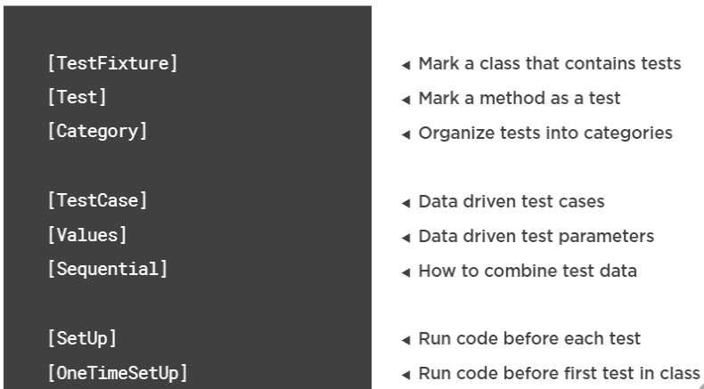
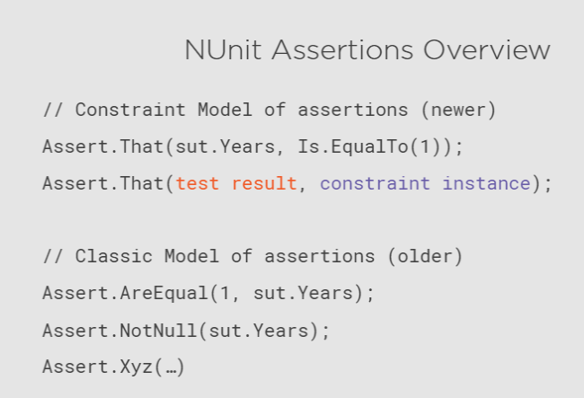

# Understanding NUnit Tests.

## NUnit Attributes overview



## NUnit Assertions overview

`Assert` có hai kiểu là **Constraint Model (newer)** và **Classic Model (older)**.

**Classic Model** vẫn được support nhưng nó sẽ không được thêm các tính năng mới.

**Constraint Model** nên được dùng vì sẽ được access toàn bộ các capabilites của NUnit.



## The logical Arrange, Act, Assert test phrases.

Trong unit test thì có 3 thành phần, nhưng trong trường hợp thực tế không phải lúc nào ta cũng phải đủ cả 3 thành phần bên dưới cả.

**Arange:** Set up test object(s), initialize, test data...

**Act:** call method, set property, ...

**Assert:** compare returned value/ end state with exprected.

```c#
[Test]
public void ReturnTermInMonths()
{
    // Arrange
    var sut= new LoanTerm(1);
    // Act
    var numberOfMonths= sut.ToMonths();
    // Assert
    Assert.That(numberOfMonths, Is.EqualTo(12));            
}

```

# Aserting on different Types of Results.

## The NUnit Constrain Model of Assertions.

## Asserting on Equality

