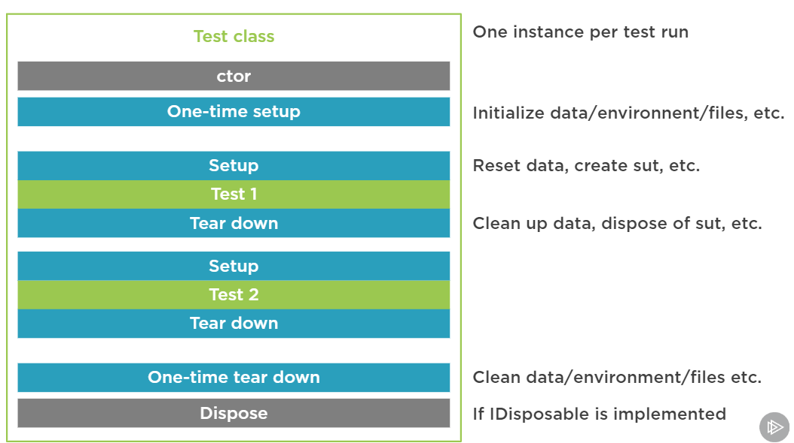

# .NET TESTING WITH Nunit 3

## 4. Asserting on different types of results

### 4.1 The Nunit Constrain Model of Assertings.

Có 2 kiểu cho assert.

Thông thường

```c#
Assert.That(sut.Years, Is.EqualTo(1));
```

Hoặc 

```c#
Assert.That(sut.Years, new EqualConstraint(1));
```

`Is` là một abstract class nó có thể chứa các method sau:

```c#
EqualConstrant()
FalseConstrain()
GreaterThanConstrant()
```

Trong method `That`thì nó như sau:

Thì `TResolveConstraint` là một base interface mà các kiểu khác nó kế thừa lại.

```c#
That<TActual> (TActual actual, TResolveConstraint expression){...}
```

```c#
public class Equalconstraint: Constraint{}

public abstract class Constraint: IConstraint{}

public interface IConstrant: IResolveConstraint{}
```

### 4.2 Asserting on Equality

**Khi ta assert mà kiểu object thì ta cần override lại method `EqualTo` nếu ta dùng nó để compare two objects.**

```c#
public override bool Equals(object obj)
{
    if (obj == null || obj.GetType() != GetType())
    {
        return false;
    }

    ValueObject other = (ValueObject)obj;
    IEnumerator<object> thisValues = GetAtomicValues().GetEnumerator();
    IEnumerator<object> otherValues = other.GetAtomicValues().GetEnumerator();

    while (thisValues.MoveNext() && otherValues.MoveNext())
    {
        if (ReferenceEquals(thisValues.Current, null) ^ ReferenceEquals(otherValues.Current, null))
        {
            return false;
        }
        if (thisValues.Current != null && !thisValues.Current.Equals(otherValues.Current))
        {
            return false;
        }
    }
    return !thisValues.MoveNext() && !otherValues.MoveNext();
}

public override int GetHashCode()
{
    return GetAtomicValues()
        .Select(x => x != null ? x.GetHashCode() : 0)
        .Aggregate((x, y) => x ^ y);
}
```
**Sau đó ta sử dụng như sau:**

So so sánh **a** có bằng **b** hay không

```c#
[Test]
public void RespectValueEquality()
{
    var a = new LoanTerm(1);
    var b = new LoanTerm(1);

    Assert.That(a, Is.EqualTo(b));
}
```

So so sánh **a** không bằng **b** hay không

```c#
[Test]
public void RespectValueInequality()
{
    var a = new LoanTerm(1);
    var b = new LoanTerm(2);

    Assert.That(a, Is.Not.EqualTo(b));
}
```

### 4.3 Asserting on reference equality

Ta dùng `SameAs` để kiểm tra cho kiểu dữ liệu object xem có cùng reference hay không.

```c#
[Test]
public void ReferenceEqualityExample()
{
    var a = new LoanTerm(1);
    var b = a;
    var c = new LoanTerm(1);

    Assert.That(a, Is.SameAs(b));
    Assert.That(a, Is.Not.SameAs(c));

    var x = new List<string> { "a", "b" };
    var y = x;
    var z = new List<string> { "a", "b" };

    Assert.That(y, Is.SameAs(x));
    Assert.That(z, Is.Not.SameAs(x));
}
```

### 4.4 Adding custom failure message.

Test case bên dưới ta thêm vào một message **Months should be 12 * number of years** khi test case fail nó sẽ hiển thị message này.

```c#
[Test]
public void ReturnTermInMonths()
{
    var sut = new LoanTerm(1);

    Assert.That(sut.ToMonths(), Is.EqualTo(12), "Months should be 12 * number of years");
}
```

### 4.5 Asserting on floating point value.

Giá trị **a** bên dưới là 0.33333333... nên trong 2 methods Assert bên dưới:

Assert đầu tiên ta chỉ ra là sai lệch trong khoản 0.004

Assert thứ hai là sai lệch trong khoản 10%

```c#
[Test]
public void Double()
{
    double a = 1.0 / 3.0;

    Assert.That(a, Is.EqualTo(0.33).Within(0.004));
    Assert.That(a, Is.EqualTo(0.33).Within(10).Percent);
}
```

### 4.6 Asserting on collection content.

Đoạn code bên dưới sẽ kiểm tra là `comparisons` được tính toán khi trả về có phải là chứa 3 phần tử như mong đợi như của `products` hay không.

```c#
[Test]
public void ReturnCorrectNumberOfComparisons()
{
    var products = new List<LoanProduct>
    {
        new LoanProduct(1, "a", 1),
        new LoanProduct(2, "b", 2),
        new LoanProduct(3, "c", 3)
    };

    var sut = new ProductComparer(new LoanAmount("USD", 200_000m), products);

    List<MonthlyRepaymentComparison> comparisons =
        sut.CompareMonthlyRepayments(new LoanTerm(30));

    Assert.That(comparisons, Has.Exactly(3).Items);
}
```

Đoạn code bên dưới sẽ kiểm tra xem giá trị của `comparions` khi trả về có giá trị nào bị trùng hay không.

```c#
[Test]
public void NotReturnDuplicateComparisons()
{
    var products = new List<LoanProduct>
    {
        new LoanProduct(1, "a", 1),
        new LoanProduct(2, "b", 2),
        new LoanProduct(3, "c", 3)
    };

    var sut = new ProductComparer(new LoanAmount("USD", 200_000m), products);

    List<MonthlyRepaymentComparison> comparisons =
        sut.CompareMonthlyRepayments(new LoanTerm(30));

    Assert.That(comparisons, Is.Unique);
}
```

Trong đoạn chương trình bên dưới sẽ kiểm tra xem giá trị của `comparisons` khi trả về có chứa `exprectedProduct` hay không. Với cách tiếp cần này ta cần phải biết trước và định nghĩa trước giá trị của `exxpectedProduct` để có thể thực hiện **Assert** như bên dưới.

```c#
public void ReturnComparisonForFirstProduct()
{
    var products = new List<LoanProduct>
    {
        new LoanProduct(1, "a", 1),
        new LoanProduct(2, "b", 2),
        new LoanProduct(3, "c", 3)
    };

    var sut = new ProductComparer(new LoanAmount("USD", 200_000m), products);

    List<MonthlyRepaymentComparison> comparisons =
        sut.CompareMonthlyRepayments(new LoanTerm(30));

    // Need to also know the expected monthly repayment
    var expectedProduct = new MonthlyRepaymentComparison("a", 1, 643.28m);

    Assert.That(comparisons, Does.Contain(expectedProduct));
}
```

Trong đoạn chương trình bên dưới với **Approach 1**  ta mong muốn rằng giá trịn của list `comparisons` khi trả về chỉ có một phần tử và các propperties của phần tử đó phải có các giá trị mà ta mong muốn. với cách tiếp cần này nếu properties của object mà ta cần test bị thay đổi trong tương lai, **thì ta cũng phải thay đổi các tên của các properties đó trong test case**.

Với **Approach 2** ta sẽ chỉ định model mà ta cần test và cần lấy các property ra và sau đó là thực hiện việc so sánh bằng cách gọi tới lamda expression. (model chứa các properties ở đây mà ta muốn test các giá trị là **MonthlyRepaymentComparison**).

```c#
[Test]
public void ReturnComparisonForFirstProduct_WithPartialKnownExpectedValues()
{
    var products = new List<LoanProduct>
    {
        new LoanProduct(1, "a", 1),
        new LoanProduct(2, "b", 2),
        new LoanProduct(3, "c", 3)
    };

    var sut = new ProductComparer(new LoanAmount("USD", 200_000m), products);

    List<MonthlyRepaymentComparison> comparisons =
        sut.CompareMonthlyRepayments(new LoanTerm(30));

    //Don't care about the expected monthly repayment, only that the product is there
    
    // Approach 1
    Assert.That(comparisons, Has.Exactly(1)
                                .Property("ProductName").EqualTo("a")
                                .And
                                .Property("InterestRate").EqualTo(1)
                                .And
                                .Property("MonthlyRepayment").GreaterThan(0));
    // Approach 2
    Assert.That(comparisons, Has.Exactly(1)
                                .Matches<MonthlyRepaymentComparison>(
                                        item => item.ProductName == "a" &&
                                                item.InterestRate == 1 &&
                                                item.MonthlyRepayment > 0));
}
```

### 4.7 Asserting That Exceptions Are Thrown

Trong đoạn code bên dưới:

**Case 1:** Kiểm tra xem exception bị throw ra có phải là `ArgumentOutOfRangeException` hay không

**Case 2:** Như **Case 1** nhưng thêm là lỗi được vứt ra với **Message** có phải là **Please specify a value greater than 0.\r\nParameter name: years** hay không.

**Case 3:** Như **Case 2** nhưng ở đây ta thay vì hard code chỉ định là tên property là **Message**.

**Case 4:** Kiểm tra xem nguyên nhân gây lỗi có phải do **years** hay không? bằng cách get giá trị của property **ParamName** là parameter được gọi và gây ra lỗi

**Case 5:** Là enhence của **Case 4** để sau này dễ maintain code.

```c#
[Test]
public void NotAllowZeroYears()
{
    // Case 1
    Assert.That(() => new LoanTerm(0), Throws.TypeOf<ArgumentOutOfRangeException>());
    
    // Case 2
    Assert.That(() => new LoanTerm(0), Throws.TypeOf<ArgumentOutOfRangeException>()
                        .With
                        .Property("Message")
                        .EqualTo("Please specify a value greater than 0.\r\nParameter name: years"));
    // Case 3
    Assert.That(() => new LoanTerm(0), Throws.TypeOf<ArgumentOutOfRangeException>()
                        .With
                        .Message
                        .EqualTo("Please specify a value greater than 0.\r\nParameter name: years"));
    // Case 4
    // Correct ex and para name but don't care about the message
    Assert.That(() => new LoanTerm(0), Throws.TypeOf<ArgumentOutOfRangeException>()
                        .With
                        .Property("ParamName")
                        .EqualTo("years"));
    // Case 5
    Assert.That(() => new LoanTerm(0), Throws.TypeOf<ArgumentOutOfRangeException>()
                                    .With
                                    .Matches<ArgumentOutOfRangeException>(
                                        ex => ex.ParamName == "years"));
}
```

### 4.8 Other Asertion examples

**Assert với NUll value**

```c#
Assert.That(name, Is.null)
Assert.That(name, Is.Not.Null)
```

**Assert với string value**

```c#
Assert.That(name, Is.Empty);
Assert.That(name, Is.Not.Empty);

Assert.That(name, Is.EqualTo("abc")) // Lưu ý là có phần biệt hoa thường
Assert.That(name, Is.EqualTo("abc").IgnoreCase); // Không phần biệt hoa thường "ABC" với "abc" là giống nhau.

Assert.That(name, Does.StartWith("ab")) // Kiểm tra chuỗi có phải bắt đầu bằng "ab" hay không
Assert.That(name, Does.EndWith("ab")) // Kiểm tra xem chuỗi có phải kết thúc bằng "ab" hay không

Assert.That(name, Does.Contain("ab")) // Kiểm tra xem chuỗi có chứa "ab" hay không
Assert.That(name, Does.Not.Contain("ab")) // Kiêm tra xem chuỗi không có chứa "ab"

Assert.That(name, Does.StartWith("ab")
                        .And.EndsWith("cd")); // Kiểm tra xem chuỗi có bắt đầu với "ab" và kết thúc với "cd" hay không

Assert.that(name, Does.StartWith("abc")
                        .Or.EndsWitch("xyz")); // Kiểm tra chuỗi có bắt đầu bằng "abc" hoặc kết thúc bằng "xyz"

```

**Asserting on Boolean values**

```c# 
bool isNew = true;
Assert.That(isNew); // pass
Assert.That(isNew, Is.True); // pass

bool areMarried = false;
Assert.That(areMarried == false); // pass
Assert.That(areMarried, Is.False); // pass
Assert.That(areMarried, Is.Not.True); // pass
```

**Asserting within Ranges**

```c#
DateTime d1 = new DateTime(2000, 2, 20);
Datetime d2 = new DateTime(2000, 2, 25);

Assert.That(d1, Is.EqualTo(d2)); // fail
Assert.That(d1, Is.EqualTo(d2).Within(4).Days); // fail
Assert.That(d1, Is.EqualTo(d2).Within(5).Days); pass
```

Xem thêm các asertion ở https://docs.nunit.org/articles/nunit/writing-tests/constraints/Constraints.html


## 5. Controlling Test Execution

### 5.1 Ignoring Tests

Để ingore một test case hay một test class, ta dùng attribute `[Ignore("Reason to ingore")] `.

Ví dụ là ta đang ingoring một test case.

```c#
[Test]
[Ignore("Need to complete update work.")]        
public void ReturnTermInMonths()
{
    // Something here...
}
```

### 5.2 Organizing tests into categories

Nếu ta muốn nhóm các test cases vào một nhóm lại với nhau ta dùng `[Category(Tên category)]]` để nhóm các test cases vào một category với nhau. Lúc này trong màn hình **Test Explorer** sẽ nhóm các test cases của ta theo các category.

Ta có thể dùng attribute này cho **Test Class** nếu ta muốn hết tất cả các test cases trong test class đó cũng thuộc một **Category**.

### 5.3 An Overview of the test execution lifecycle.

Không giống như các unit test framework khác (như xUnit) thì Nunit chỉ tạo một instance cho test class, dù cho test class đó có bao nhiêu test method. (với xUnit  thì ứng với mỗi test method sẽ được tạo mới một instance của test class để thực thi)

Thứ tự thực hiện trong một **Test Class**

**Constructor => test case 1 => test case 2 .... test case n=> Dispose (từ IDisposable)**

Ta có thể can thiệp vào thứ tực thực hiện trên bằng cách thêm vào **One-time setup**, **Setup**, **TearDown**

Ta có thể xem hình sau để có thể có cái nhìn bao quát hơn.



### 5.4 Running Code before and after Each Test

**Before:** Khi mà ta có các business lập đi lặp lại nhiều lần trong mỗi test case thì ta nên đặt nó vào phần **Setup**, vì mỗi khi execute mỗi test case trong test class nó sẽ gọi lại phần setup này.

**After:** Khi execute xong mỗi test case mà ta muốn clear gì đó để chuẩn bị cho chạy test case tiếp theo ta implement method có attribute là `[TearDown]`. Nếu test method của ta mà có implement **IDispose()** thì ta cũng gọi luôn trong `TearDown`.


```c#
[Category("Product Comparison")]
public class ProductComparerShould
{
    private List<LoanProduct> products;
    private ProductComparer sut;

    [SetUp]
    public void Setup()
    {
        products = new List<LoanProduct>
        {
            new LoanProduct(1, "a", 1),
            new LoanProduct(2, "b", 2),
            new LoanProduct(3, "c", 3)
        };

        sut = new ProductComparer(new LoanAmount("USD", 200_000m), products);
    }

    [TearDown]
    public void TearDown()
    {
        // Runs after each test executes
        // sut.Dispose();
    }

    [Test]        
    public void ReturnCorrectNumberOfComparisons()
    {
        List<MonthlyRepaymentComparison> comparisons =
            sut.CompareMonthlyRepayments(new LoanTerm(30));

        Assert.That(comparisons, Has.Exactly(3).Items);
    }
}
```

### 5.5 Running Code before and after Each Test Class

Khi mà data được sử dụng cho test class được khở tạo một lần duy nhất và được sử dụng xuyên sốt cho các test case của nó thì ta dùng `[OnetimeSetup]`

`[OnetimeSetup]` sẽ được gọi trước cả `[SetUp]` để khởi tạo giá trị cho test class đó.

Khi ta sử dụng data trong `[OnetimeSetup]` thì các data trong đó sẽ được thay đổi, vì nếu data trong đó khi bị thay đổi khi thực thi trong một test case nào đó, thì test case kế tiếp khi sử dụng data mà được tạo ra trong `[OnetimeSetup]` sẽ bị ảnh hưởng kết quá.

Khi mà ta sử dụng xong data trong `[OnetimeSetup]` thì khi ta muốn despose nó thì ta dùng `[OneTimeTearDown]` để thực hiện giải phóng bộ nhớ.

```c#
[Category("Product Comparison")]
public class ProductComparerShould
{
    private List<LoanProduct> products;
    private ProductComparer sut;

    [OneTimeSetUp]
    public void OneTimeSetUp()
    {
        // Simulate long setup init time for this list of products
        // We assume that this list will not be modified by any tests
        // as this will potentially break other tests (i.e. break test isolation)
        products = new List<LoanProduct>
        {
            new LoanProduct(1, "a", 1),
            new LoanProduct(2, "b", 2),
            new LoanProduct(3, "c", 3)
        };
    }


    [OneTimeTearDown]
    public void OneTimeTearDown()
    {
        // Run after last test in this test class (fixture) executes
        // e.g. disposing of shared expensive setup performed in OneTimeSetUp

        // products.Dispose(); e.g. if products implemented IDisposable
    }

    [SetUp]
    public void Setup()
    {
        sut = new ProductComparer(new LoanAmount("USD", 200_000m), products);
    }

    [TearDown]
    public void TearDown()
    {
        // Runs after each test executes
        // sut.Dispose();
    }

    [Test]        
    public void ReturnCorrectNumberOfComparisons()
    {
        List<MonthlyRepaymentComparison> comparisons =
            sut.CompareMonthlyRepayments(new LoanTerm(30));

        Assert.That(comparisons, Has.Exactly(3).Items);
    }

    // the rest of other test cases below...
}
```

## 6 Creating data driven tests and reducing test code duplication.

### 6.1 Providing Method Level Test Data

Khi ta muốn test method execute qua một tập dữ liệu test data thì ta dùng atribute ``[TestCase(...)]`` bên trong dấu () ta chỉ ra các test data để test method dùng và expected result khi dùng các data này chạy qua test method.

Bên dưới test method ta sẽ chỉ ra các parameter tương ứng với các data mà ta setup trong attribute `TestCase` mà ta để phía trên.

```c#
[Test]
[TestCase(200_000, 6.5, 30, 1264.14)]
[TestCase(200_000, 10, 30, 1755.14)]
[TestCase(500_000, 10, 30, 4387.86)]
public void CalculateCorrectMonthlyRepayment(decimal principal,
                                                decimal interestRate,
                                                int termInYears,
                                                decimal expectedMonthlyPayment)
{
    var sut = new LoanRepaymentCalculator();

    var monthlyPayment = sut.CalculateMonthlyRepayment(
                                new LoanAmount("USD", principal), 
                                interestRate, 
                                new LoanTerm(termInYears));

    Assert.That(monthlyPayment, Is.EqualTo(expectedMonthlyPayment));
}
```

### 6.2 Simplifying TestCase Expected Values

Thay vì ta gọi đến Assert như cách bên trên, thì ta có thể làm gọn lại như bên dưới.

Ta chỉ cần thêm tường mình `ExpectedResult` và sau đó trong test method thì return về giá trị actual result, sau đó việc còn lại nó sẽ tự so sánh.

```c#
[Test]
[TestCase(200_000, 6.5, 30, ExpectedResult = 1264.14)]
[TestCase(200_000, 10, 30, ExpectedResult = 1755.14)]
[TestCase(500_000, 10, 30, ExpectedResult = 4387.86)]
public decimal CalculateCorrectMonthlyRepayment_SimplifiedTestCase(decimal principal,
                                        decimal interestRate,
                                        int termInYears)
{
    var sut = new LoanRepaymentCalculator();

    return sut.CalculateMonthlyRepayment(
                                new LoanAmount("USD", principal),
                                interestRate,
                                new LoanTerm(termInYears));
}
```

### 6.3 Sharing Test Data across Multiple Tests

Đôi khi ta cần sharing hay dùng chung các test case lại với nhau để có thể dùng cho nhiều test methods ở các test class khác nhau thì ta làm như sau:

Tạo một class mà sẽ chứa các `TestCaseData`

```c#
public class MonthlyRepaymentTestData
{
    public static IEnumerable TestCases
    {
        get
        {
            yield return new TestCaseData(200_000m, 6.5m, 30, 1264.14m);
            yield return new TestCaseData(500_000m, 10m, 30, 4387.86m);
            yield return new TestCaseData(200_000m, 10m, 30, 1755.14m);
        }
    }
}
```

Trong test method ta sẽ dùng như sau

```c#
[Test]
[TestCaseSource(typeof(MonthlyRepaymentTestData), "TestCases")]
public void CalculateCorrectMonthlyRepayment_Centralized(decimal principal,
                                        decimal interestRate,
                                        int termInYears,
                                        decimal expectedMonthlyPayment)
{
    var sut = new LoanRepaymentCalculator();

    var monthlyPayment = sut.CalculateMonthlyRepayment(
                                new LoanAmount("USD", principal),
                                interestRate,
                                new LoanTerm(termInYears));

    Assert.That(monthlyPayment, Is.EqualTo(expectedMonthlyPayment));
}
```

Đối với test method mà ta viết theo kiểu có return thì ta làm như sau:

Tạo một class có chứa các `TestCaseData`, ta chú ý vào `.Returns(1264.14)` đây chính là expected value của bộ test data ứng với từng `TestCaseData`.

```c#
public class MonthlyRepaymentTestDataWithReturn
{
    public static IEnumerable TestCases
    {
        get
        {
            yield return new TestCaseData(200_000m, 6.5m, 30).Returns(1264.14);
            yield return new TestCaseData(200_000m, 10m, 30).Returns(1755.14);
            yield return new TestCaseData(500_000m, 10m, 30).Returns(4387.86);
        }
    }
}
```
Trong test method ta dùng như sau:

```c#
[Test]
[TestCaseSource(typeof(MonthlyRepaymentTestDataWithReturn), "TestCases")]
public decimal CalculateCorrectMonthlyRepayment_CentralizedWithReturn(decimal principal,
                                decimal interestRate,
                                int termInYears)
{
    var sut = new LoanRepaymentCalculator();

    return sut.CalculateMonthlyRepayment(
                                new LoanAmount("USD", principal),
                                interestRate,
                                new LoanTerm(termInYears));
}
```

### 6.4 Reading Test Data from External Sources

Để đọc các tets data tư một file nào đó ta làm như sau:

**Lưu ý:** Khi ta add file chứa các test data thì ta phải chọn property **Copy to Output Directory** là *Copy if newer*

Để đọc data từ CSV chẵn hạn ta có thể sử dụng library **CSV Helper libray**.

Ta tham khảo đoạn code bên dưới dùng để tạo TestCaseData từ file CSV

```c#
public class MonthlyRepaymentCsvData
{
    public static IEnumerable GetTestCases(string csvFileName)
    {
        var csvLines = File.ReadAllLines(csvFileName);

        var testCases = new List<TestCaseData>();

        foreach (var line in csvLines)
        {
            string[] values = line.Replace(" ", "").Split(',');

            decimal principal = decimal.Parse(values[0]);
            decimal interestRate = decimal.Parse(values[1]);
            int termInYears = int.Parse(values[2]);
            decimal expectedRepayment = decimal.Parse(values[3]);

            testCases.Add(new TestCaseData(principal, interestRate, termInYears, expectedRepayment));
        }

        return testCases;
    }
}
```

Khi ta sử dụng trong test method sẽ như sau:

Trong đó `new object[] { "Data.csv" }` là tên của file chứa test case mà ta muốn đọc ra

```c#
[Test]
[TestCaseSource(typeof(MonthlyRepaymentCsvData), "GetTestCases", new object[] { "Data.csv" })]
public void CalculateCorrectMonthlyRepayment_Csv(decimal principal,
                                decimal interestRate,
                                int termInYears,
                                decimal expectedMonthlyPayment)
{
    var sut = new LoanRepaymentCalculator();

    var monthlyPayment = sut.CalculateMonthlyRepayment(
                                new LoanAmount("USD", principal),
                                interestRate,
                                new LoanTerm(termInYears));

    Assert.That(monthlyPayment, Is.EqualTo(expectedMonthlyPayment));
}
```

### 6.5 Generating Test Data

Để test các data với một tập dữ liệu mà ta biết trước range của nó (giá trị bắt đầu, giá trị kết thúc và khoản cách giữ 2 giá trị là bao nhiều (bước nhảy)) thì ta dùng attribute `Range` để tạo ra test data.

**Case 1** NUnit sẽ tạo một bộ combination các test data với nhau, như trong trường hợp bên dưới sẽ có 27 test cases được tạo ra với tập dữ liệu bên dưới. Với Approach này sẽ thích hợp với việc ta muốn kiểm tra xem có exeption nào bị throw ra hay không khi run test.

**Case 2** Khi sử dụng với atribute `[Sequential]` thì Unuit sẽ không đi combine các test data với nhau mà chỉ sử dụng các test data mà ta chỉ ra, như trong demo bên dưới thì chỉ có 3 test data mà ta chỉ định ra.

**Case 3** Ở trường hợp này ta dùng `[Range(50_000, 1_000_000, 50_000)]decimal principal,` thì giá trị sẽ bắt đầu là 50.000 và kết thúc là 1.000.000 và bước nhảy là 50.000. NUnit sẽ dựa vào đó mà tạo ra một tập dữ liệu cho test data của giá trị của **principal** value.


```c#

// Case 1
[Test]
public void CalculateCorrectMonthlyRepayment_Combinatorial(
    [Values(100_000, 200_000, 500_000)]decimal principal,
    [Values(6.5, 10, 20)]decimal interestRate,
    [Values(10, 20, 30)]int termInYears)
{
    var sut = new LoanRepaymentCalculator();

    var monthlyPayment = sut.CalculateMonthlyRepayment(
        new LoanAmount("USD", principal), interestRate, new LoanTerm(termInYears));
}

// Case 2
[Test]
[Sequential]
public void CalculateCorrectMonthlyRepayment_Sequential(
            [Values(200_000, 200_000, 500_000)]decimal principal,
            [Values(6.5, 10, 10)]decimal interestRate,
            [Values(30, 30, 30)]int termInYears,
            [Values(1264.14, 1755.14, 4387.86)]decimal expectedMonthlyPayment)
{
    var sut = new LoanRepaymentCalculator();

    var monthlyPayment = sut.CalculateMonthlyRepayment(
        new LoanAmount("USD", principal), interestRate, new LoanTerm(termInYears));

    Assert.That(monthlyPayment, Is.EqualTo(expectedMonthlyPayment));
}

// Case 3
[Test]
public void CalculateCorrectMonthlyRepayment_Range(
    [Range(50_000, 1_000_000, 50_000)]decimal principal,
    [Range(0.5, 20.00, 0.5)]decimal interestRate,
    [Values(10, 20, 30)]int termInYears)
{
    var sut = new LoanRepaymentCalculator();

    sut.CalculateMonthlyRepayment(
        new LoanAmount("USD", principal), interestRate, new LoanTerm(termInYears));
}
```

### 6.6 Creating Custom Category Attributes

Để tạo một custom attribute cho test class hay test method ta làm như sau

```c#
[AttributeUsage(AttributeTargets.Method | AttributeTargets.Class, AllowMultiple = false)]
class ProductComparisonAttribute : CategoryAttribute
{
}
```

Sau đó ta gọi ra sử dụng như sau:

```c#
[ProductComparison]
public class MonthlyRepaymentComparisonShould
{
    [Test]        
    public void RespectValueEquality()
    {
        var a = new MonthlyRepaymentComparison("a", 42.42m, 22.22m);
        var b = new MonthlyRepaymentComparison("a", 42.42m, 22.22m);

        Assert.That(a, Is.EqualTo(b));
    }

    [Test]        
    public void RespectValueInequality()
    {
        var a = new MonthlyRepaymentComparison("a", 42.42m, 22.22m);
        var b = new MonthlyRepaymentComparison("a", 42.42m, 23.22m);

        Assert.That(a, Is.Not.EqualTo(b));
    }
}
```

### 6.7 Creating Custom constraints

Tạo class `MonthlyRepaymentGreaterThanZeroConstraint`

```c#
class MonthlyRepaymentGreaterThanZeroConstraint : Constraint
{
    public string ExpectedProductName { get; }
    public decimal ExpectedInterestRate { get; }

    public MonthlyRepaymentGreaterThanZeroConstraint(string expectedProductName, 
                                                        decimal expectedInterestRate)
    {
        ExpectedProductName = expectedProductName;
        ExpectedInterestRate = expectedInterestRate;
    }

    public override ConstraintResult ApplyTo<TActual>(TActual actual)
    {
        MonthlyRepaymentComparison comparison = actual as MonthlyRepaymentComparison;

        if (comparison is null)
        {
            return new ConstraintResult(this, actual, ConstraintStatus.Error);
        }

        if (comparison.InterestRate == ExpectedInterestRate && 
            comparison.ProductName == ExpectedProductName && 
            comparison.MonthlyRepayment > 0)
        {
            return new ConstraintResult(this, actual, ConstraintStatus.Success);
        }

        return new ConstraintResult(this, actual, ConstraintStatus.Failure);
    }
}
```

Sau đó ta sử dụng như sau:

```c#
[Test]
public void ReturnComparisonForFirstProduct_WithPartialKnownExpectedValues()
{
    List<MonthlyRepaymentComparison> comparisons =
        sut.CompareMonthlyRepayments(new LoanTerm(30));

    //Assert.That(comparisons, Has.Exactly(1)
    //                            .Matches<MonthlyRepaymentComparison>(
    //                                    item => item.ProductName == "a" &&
    //                                            item.InterestRate == 1 &&
    //                                            item.MonthlyRepayment > 0));

    Assert.That(comparisons,
                Has.Exactly(1)
                    .Matches(new MonthlyRepaymentGreaterThanZeroConstraint("a", 1)));

}
```