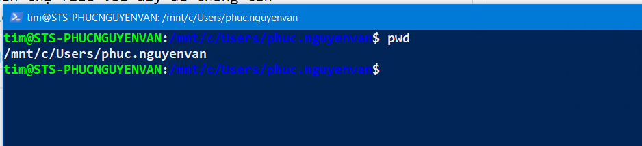
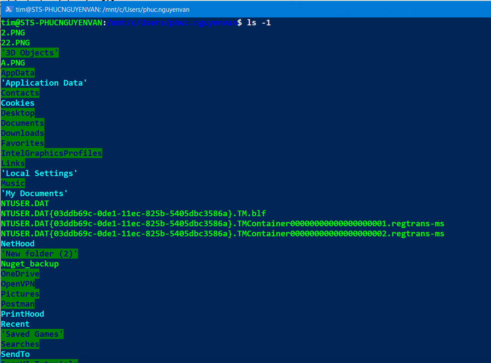
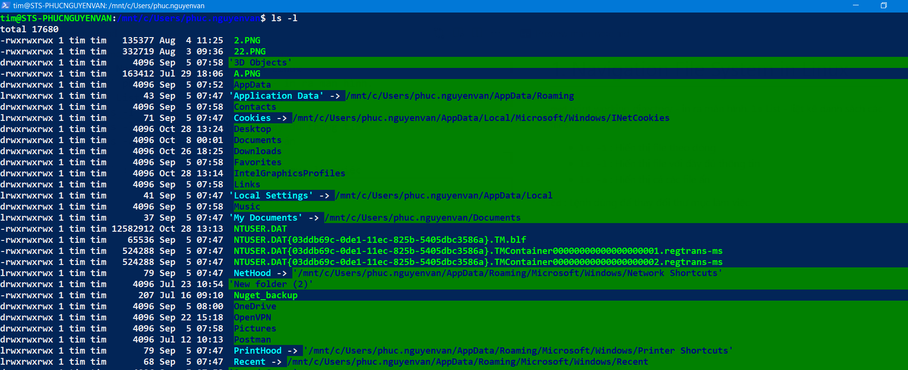
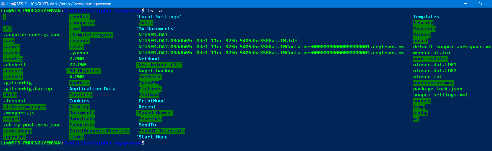
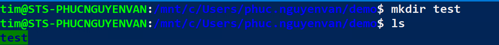
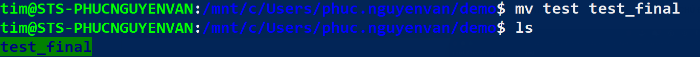
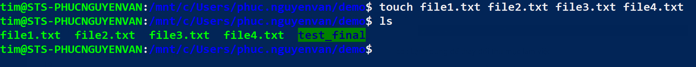
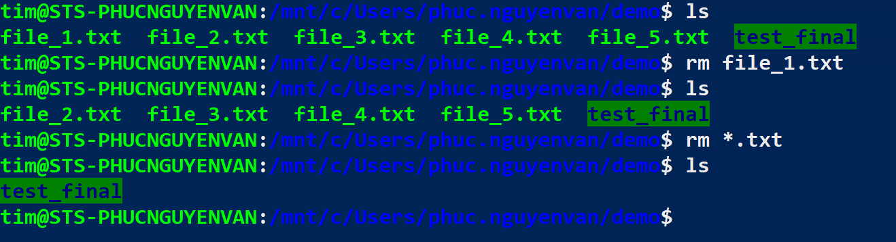

# 1. Navigation File System in Linux

`pwd` print working directory  - in ra màn hình.

`ls` List - liệt kê danh sách các files

* `ls -1` : Hiển thị file theo dòng

* `ls -l` : Hiển thị file với đầy đủ thông tin

* `ls -a` : Hiển thị cả các file ẩn

 `cd` : Lệnh dùng để thay đổi thư mục làm việc

# 2. Duy Chuyển File System

* `mkdir`: Tạo thư mục

* `mv {tên hiện tại} {tên mới}`: Di chuyển/ hoặc đổi tên thư mục

* `touch {file path/ file name.x}`: Tạo 1 file mới

* `rm {file name/pattern }` : Xóa file hoặc thư mục hoặc xóa theo pattern.
* `rm -r {tên thư mục}` : Xóa thư mục

