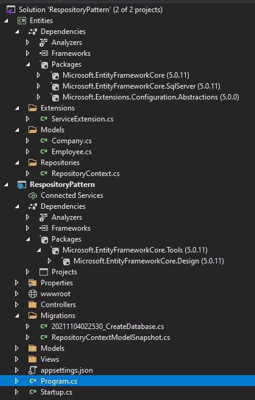

# 1. Project structure



Trong đó:

## Project **Entities** cần add vào các packages sau:
* `Microsoft.EntityFrameworkCore`
* `Microsoft.EntityFrameworkCore.SqlServer`
* `Microsoft.Extensions.Configuration.Abstractions`

Folder **Extensions** sẽ  chứa các phương thức mở rộng.

Folder **Models** sẽ chứa các Entity ứng với các table dưới DB.

Folder **Repositories** sẽ chứa các `repositories` và các `DbContext`

## Project **RespositoryPattern** là một ứng dụng Asp.net Core MVC.
Ta cần add vào package `Microsoft.EntityFrameworkCore.Tools` vào project này để làm việc với EF Core.


# 2. Creating Models
`Models` sẽ được tạo trong folder **Models** của project **Entities**.
Ta thêm 2 models `Company` và `Employee` như sau:

Đối với entity `Company` ta chú ý tới `public ICollection<Employee> Employees { get; set; }` đây là thuộc tính navigation trỏ đến `Employee`.
```C#
public class Company
{
    [Column("CompanyId")]
    public Guid Id { get; set; }

    [Required(ErrorMessage = "Company name is a required field.")]
    [MaxLength(60, ErrorMessage = "Maximum length for the Name is 60 characters.")]
    public string Name { get; set; }

    [Required(ErrorMessage ="Company address is required field.")]
    [MaxLength(60, ErrorMessage ="Maximum length for the Address is 60 character.")]
    public string Address { get; set; }

    public string Country { get; set; }

    public ICollection<Employee> Employees { get; set; }
}
```

Đối với entity `Employee` ta chú ý đến 2 dòng code bên dưới, đây là khóa ngoại của `Employee` đến `Company`.

```C#
public Guid CompanyId { get; set; }
public Company Company { get; set; }
```

```C#
public class Employee
{
    [Column("EmployeeId")]
    public Guid Id { get; set; }

    [Required(ErrorMessage = "Employee name is a required field.")]
    [MaxLength(30, ErrorMessage ="Maximum lengh for the Name is 30 character.")]
    public string Name { get; set; }

    [Required(ErrorMessage ="Age is a required field.")]
    public int Age { get; set; }

    [Required(ErrorMessage ="Position is a required field.")]
    [MaxLength(20, ErrorMessage ="Maximum length for the Position is 20 characters.")]
    public string Position { get; set; }

    [ForeignKey(nameof(Company))]
    public Guid CompanyId { get; set; }
    public Company Company { get; set; }
}
```

# 3 Create Context Class and Database connection.

Trong folder `Repositories` của project `Entities` ta tạo mới một class `RepositoryContext` như sau:

```c#
public class RepositoryContext:DbContext
{
    public RepositoryContext(DbContextOptions options):base(options)
    {
    }

    public DbSet<Company> Companies { get; set; }
    public DbSet<Employee> Employees { get; set; }
}
```

Trong file `appsettings.json` của project `RepositoryPattern` ta thêm vào chuỗi connectionstring như sau:

```json
{
  "Logging": {
    "LogLevel": {
      "Default": "Information",
      "Microsoft": "Warning",
      "Microsoft.Hosting.Lifetime": "Information"
    }
  },
  "ConnectionStrings": {
    "sqlConnection" : "server=.; database=CompanyEmployee; Integrated security=true"
  },
  "AllowedHosts": "*"
}
```

Trong folder `Extensions` ta thêm một class mới `ServiceExtension` và trong đó có method `ConfigureSqlContext` dùng để đăng ký chuỗi kết nối từ file `appsettings.json` như sau:

```c#
public static class ServiceExtension
{
    public static void ConfigureSqlContext(this IServiceCollection services, IConfiguration configuration)
    {
        services.AddDbContext<RepositoryContext>(opts => 
        opts.UseSqlServer(configuration.GetConnectionString("sqlConnection"),b => b.MigrationsAssembly("RespositoryPattern")));
    }
}
```

Trong `Startup` class của project `RepositoryPattern` ta đăng ký service để lấy connectionstring như sau:

```c#
public void ConfigureServices(IServiceCollection services)
{
    services.AddControllersWithViews();
    services.ConfigureSqlContext(Configuration);
}
```
# 4. Database Migration.
*Trước khi thực hiện migration, nếu chưa install EF Core tool ta cần thực hiện cài đặt mức global như sau:*

`dotnet tool install --global dotnet-ef`

Từ project `RepositoryPattern` ta mở terminal lên vã thực hiện lệnh sau để tạo migration file:

`dotnet ef migrations add CreateDatabase`

Để apply migration file xuống database ta thực hiện lệnh sau:

`dotnet ef database update`

# 5. Initial Data Seed.

Trong project `Entities` thêm mới một folder `Configuration` để chứa các seeding data.

**Seeding cho `Company`**

```C#
public class CompanyConfiguration : IEntityTypeConfiguration<Company>
{
    public void Configure(EntityTypeBuilder<Company> builder)
    {
        builder.HasData(
            new Company { 
                Id = new Guid("c9d4c053-49b6-410c-bc78-2d54a9991870"), 
                Name = "Company 1", 
                Address = "Street 1",
                Country = "USA" }, 
            new Company { 
                Id = new Guid("3d490a70-94ce-4d15-9494-5248280c2ce3"), 
                Name = "Company 2", 
                Address = "Street 2", 
                Country = "VN" });
    }
}
```

**Seeding cho `Employee`**

```c#
public class EmployeeConfiguration : IEntityTypeConfiguration<Employee>
{
    public void Configure(EntityTypeBuilder<Employee> builder)
    {
        builder.HasData(
            new Employee { 
                Id = new Guid("80abbca8-664d-4b20-b5de-024705497d4a"), 
                Name = "SD 1", 
                Age = 26, 
                Position = "SD",
                CompanyId = new Guid("c9d4c053-49b6-410c-bc78-2d54a9991870") },
            new Employee { 
                Id = new Guid("86dba8c0-d178-41e7-938c-ed49778fb52a"), 
                Name = "SD 1", 
                Age = 30, 
                Position = "SD", 
                CompanyId = new Guid("c9d4c053-49b6-410c-bc78-2d54a9991870") }, 
            new Employee { 
                Id = new Guid("021ca3c1-0deb-4afd-ae94-2159a8479811"), 
                Name = "Admin", 
                Age = 35, 
                Position = "Admin", 
                CompanyId = new Guid("3d490a70-94ce-4d15-9494-5248280c2ce3") });
    }
}
```

Trong class `RepositoryContext` ta thêm 2 classes seeding mà ta vừa tạo:

```c#
public class RepositoryContext:DbContext
{
    public RepositoryContext(DbContextOptions options):base(options)
    {
    }

    protected override void OnModelCreating(ModelBuilder modelBuilder)
    {
        modelBuilder.ApplyConfiguration(new CompanyConfiguration());
        modelBuilder.ApplyConfiguration(new EmployeeConfiguration());

    }

    public DbSet<Company> Companies { get; set; }
    public DbSet<Employee> Employees { get; set; }
}
```

Ta thực hiện lệnh tạo migration để add các seeding data bằng lệnh sau: 

```
dotnet ef migrations add InitialData
dotnet ef migrations add InitialData
