- [1. Tạo `RepositoryBase`](#1-tạo-repositorybase)
  - [1.1 Tạo interface `IRepositoryBase<T>`](#11-tạo-interface-irepositorybaset)
  - [1.2 Implement interface `IRepositoryBase<T>`](#12-implement-interface-irepositorybaset)
- [2. Tạo các repository mà sử dụng `RepositoryBase`](#2-tạo-các-repository-mà-sử-dụng-repositorybase)
- [3. Tạo Repository Manager.](#3-tạo-repository-manager)
  - [interface](#interface)
  - [Implementation](#implementation)
- [4. Tạo extension để đăng ký DI.](#4-tạo-extension-để-đăng-ký-di)
- [5. Implement GET request.](#5-implement-get-request)
- [6. Adding `CompanyDto`](#6-adding-companydto)
- [7. Adding Automapper cho `Company` và `CompanyDto`](#7-adding-automapper-cho-company-và-companydto)
- [8. Handing error globally with the build-in Middleware.](#8-handing-error-globally-with-the-build-in-middleware)
- [9. Get a single company from database.](#9-get-a-single-company-from-database)
- [9. Parent/ child relationships in Web API (Get dữ liệu cho employee)](#9-parent-child-relationships-in-web-api-get-dữ-liệu-cho-employee)
  - [9.1 Get all employee từ một CompanyId](#91-get-all-employee-từ-một-companyid)
  - [9.2 Get single employee by EmployeeId and CompanyId](#92-get-single-employee-by-employeeid-and-companyid)
- [10. Configuration data type khi trả về.](#10-configuration-data-type-khi-trả-về)
  - [10.1 Trả về kiểu JSON hoặc XML và không allow media type.](#101-trả-về-kiểu-json-hoặc-xml-và-không-allow-media-type)
- [10.2 Trả về một custom format mà ta tự định nghĩa.](#102-trả-về-một-custom-format-mà-ta-tự-định-nghĩa)
- [11. Tạo mới một Company.](#11-tạo-mới-một-company)
- [12 Tạo mới child resource (Employee)](#12-tạo-mới-child-resource-employee)
- [13  Tạo mới Company với list các employee (Creating children resources together with a parent)](#13--tạo-mới-company-với-list-các-employee-creating-children-resources-together-with-a-parent)
- [14. Tạo mới một list company ( Create a collection of resource)](#14-tạo-mới-một-list-company--create-a-collection-of-resource)
- [15. Model binding in API](#15-model-binding-in-api)
- [16. Làm việc với DELETE request.](#16-làm-việc-với-delete-request)
  - [16.1 Delete một Employee](#161-delete-một-employee)
  - [16.2 Delete tất cả các Employee khi delete company của chúng](#162-delete-tất-cả-các-employee-khi-delete-company-của-chúng)
- [17. Làm việc với PUT Request.](#17-làm-việc-với-put-request)
  - [17.1  Cập nhật Employee.](#171--cập-nhật-employee)
  - [17.2 Inserting resources while updating one.](#172-inserting-resources-while-updating-one)
- [18 Làm việc với PATCH request.](#18-làm-việc-với-patch-request)
  - [18.1 Apply PATCH cho Employee](#181-apply-patch-cho-employee)
- [19. Validation](#19-validation)
  - [19.1 Validating khi tạo mới employee.](#191-validating-khi-tạo-mới-employee)
  - [19.2 Validating int type](#192-validating-int-type)
  - [19.3 Validation for PUT request.](#193-validation-for-put-request)
  - [19.4 Validation for PATCH request.](#194-validation-for-patch-request)
- [20 Asynchronous](#20-asynchronous)
  - [20.1 `IRepositoryBase` và `RepositoryBase`](#201-irepositorybase-và-repositorybase)
  - [20.2 Apply asynchronous cho `ICompanyRepository` và `CompanyRepository`](#202-apply-asynchronous-cho-icompanyrepository-và-companyrepository)
  - [20.3 Apply asynchronous cho `IRepositoryManager` và `RepositoryManager`](#203-apply-asynchronous-cho-irepositorymanager-và-repositorymanager)
  - [20.4 Apply asynchronous cho các controllers.](#204-apply-asynchronous-cho-các-controllers)
- [21. Action filters.](#21-action-filters)
  - [21.1 Overview](#211-overview)
  - [21.2 Create Action filter.](#212-create-action-filter)
  - [21. 3 The scope of action filter.](#21-3-the-scope-of-action-filter)
  - [21.4 Thứ tự execute của Action filter (order of infocation).](#214-thứ-tự-execute-của-action-filter-order-of-infocation)
  - [21.4 Thêm action filter cho **Company**.](#214-thêm-action-filter-cho-company)
  - [21.4 Dependency injection in Action filter.](#214-dependency-injection-in-action-filter)
- [22. Paging](#22-paging)
  - [22.1 Paging cho employee](#221-paging-cho-employee)
  - [22.1 Improving paging](#221-improving-paging)


- - -


# 1. Tạo `RepositoryBase`

 ## 1.1 Tạo interface `IRepositoryBase<T>`
```c#
public interface IRepositoryBase<T>
{
    IQueryable<T> FindAll(bool trackchanges);
    IQueryable<T> FindByConditon(Expression<Func<T,bool>> expression, bool trackChanges);
    void Create(T entity);
    void Update(T entity);
    void Delete(T entity);
}
```

## 1.2 Implement interface `IRepositoryBase<T>`

```c#
public abstract class RepositoryBase<T> : IRepositoryBase<T> where T : class
{
    protected RepositoryContext RepositoryContext;

    public RepositoryBase(RepositoryContext repositoryContext)
    {
        RepositoryContext = repositoryContext;
    }

    public IQueryable<T> FindAll(bool trackchanges)
    {
        return !trackchanges ? 
            RepositoryContext.Set<T>().AsNoTracking() : 
            RepositoryContext.Set<T>();
    }

    public IQueryable<T> FindByConditon(Expression<Func<T, bool>> expression, bool trackChanges)
    {
        return !trackChanges ? RepositoryContext.Set<T>()
            .Where(expression).AsNoTracking() :
            RepositoryContext.Set<T>()
            .Where(expression);
    }

    public void Create(T entity)
    {
        RepositoryContext.Set<T>().Add(entity);
    }

    public void Delete(T entity)
    {
        RepositoryContext.Set<T>().Remove(entity);
    }
    public void Update(T entity)
    {
        RepositoryContext.Set<T>().Update(entity
    }
}
```

# 2. Tạo các repository mà sử dụng `RepositoryBase`

```c#
public interface ICompanyRepository
{
}

public interface IEmployeeRepository
{
}
```

Tương ứng với các interface ta sẽ có các Implementation sau:

```c#
public class CompanyRepository : RepositoryBase<Company>, ICompanyRepository
{
    public CompanyRepository(RepositoryContext repositoryContext)
        :base(repositoryContext)
    {
    }
}
```

```c#
public EmployeeRepository(RepositoryContext repositoryContext) 
    : base(repositoryContext) 
{ 
}
```

# 3. Tạo Repository Manager.

## interface

```c#
public interface IRepositoryManager
{
    ICompanyRepository Company { get; }
    IEmployeeRepository Employee { get; }
    void Save();
}
```

## Implementation

```c#
public class RepositoryManager : IRepositoryManager
{
    private RepositoryContext _repositoryContext;
    private ICompanyRepository _companyRepository; 
    private IEmployeeRepository _employeeRepository;

    public RepositoryManager(RepositoryContext repositoryContext)
    {
        _repositoryContext = repositoryContext;
    }

    public ICompanyRepository Company
    {
        get
        {
            if (_companyRepository == null) 
                _companyRepository = new CompanyRepository(_repositoryContext); 
            return _companyRepository;
        }
    }

    public IEmployeeRepository Employee
    {
        get
        {
            if (_employeeRepository == null)
                _employeeRepository = new EmployeeRepository(_repositoryContext);
            return _employeeRepository;
        }
    }

    public void Save()
    {
        _repositoryContext.SaveChanges();
    }
}
```

# 4. Tạo extension để đăng ký DI.

Ta tạo một phương thức mở rộng để đăng ký DI cho `RepositoryManager` như sau:

```c#
public static void ConfigureRepositoryManager(this IServiceCollection services)
{
    services.AddScoped<IRepositoryManager, RepositoryManager>();
}
```
Trong method `ConfigureServices` của `Startup.cs` ta đăng ký thêm `services.ConfigureRepositoryManager()` như sau: 

```c#
public void ConfigureServices(IServiceCollection services)
{
    services.AddControllersWithViews();
    services.ConfigureSqlContext(Configuration);
    services.ConfigureRepositoryManager();
}
```

# 5. Implement GET request.

Trong `ICompanyRepository`, thêm phương thức `GetAllCompanies` để get tất các các companies.

```c#
public interface ICompanyRepository
{
    IEnumerable<Company> GetAllCompanies(bool trackchanges);
}
```

Implement `GetAllCompanies` trong `CompanyRepository`

```c#
public class CompanyRepository : RepositoryBase<Company>, ICompanyRepository
{
    public CompanyRepository(RepositoryContext repositoryContext)
        :base(repositoryContext)
    {
    }

    public IEnumerable<Company> GetAllCompanies(bool trackchanges)
    {
        return FindAll(trackchanges).OrderBy(c => c.Name).ToList();
    }
}
```

Trong `CompaniesController` ta implement nhuw sau: 

```c#
[Route("api/companies")]
[ApiController]
public class CompaniesController : ControllerBase
{
    private readonly IRepositoryManager _repository;

    public CompaniesController(IRepositoryManager repository)
    {
        _repository = repository;
    }

    [HttpGet]
    public IActionResult GetCompanies()
    {
        try
        {
            var companies = _repository.Company.GetAllCompanies(trackchanges: false);
            return Ok(companies);
        }
        catch (Exception ex)
        {
            // logging the error here.
            return StatusCode(500, "Internal server error");
        }
    }
}
```

# 6. Adding `CompanyDto`

Thêm mới một `CompanyDto` như sau:
```c#
public class CompanyDto
{
    public Guid Id { get; set; }
    public string Name { get; set; }
    public string FullAddress { get; set; }
}
```

Trong `CompaniesController` ta modify lại `GetCompanies` như sau:

```c#
[HttpGet]
public IActionResult GetCompanies()
{
    try
    {
        var companies = _repository.Company.GetAllCompanies(trackchanges: false);
        var companiesDto = companies.Select(c=> new CompanyDto()
        {
            Id= c.Id,
            Name = c.Name,
            FullAddress = string.Join(' ', c.Address, c.Country)
        }).ToList();

        return Ok(companiesDto);
    }
    catch (Exception ex)
    {
        // logging the error here.
        return StatusCode(500, "Internal server error");
    }
}
```

# 7. Adding Automapper cho `Company` và `CompanyDto`

Trong ứng dụng web application ta cần thêm vào một package mới như sau:

`Install-Package AutoMapper.Extensions.Microsoft.DependencyInjection`

Trong `Startup.cs` ta đăng ký service trong phương thức `ConfigureService` như sau:

```c#
public void ConfigureServices(IServiceCollection services)
{
    services.AddControllersWithViews();
    services.ConfigureSqlContext(Configuration);
    services.ConfigureRepositoryManager();
    services.AddAutoMapper(typeof(Startup));
}
```

Ta thêm mới một class `MappingProfile`, class này phải kế thừ từ `Profile` của Automapper.

```c#
public class MappingProfile:Profile
{
    public MappingProfile()
    {
        CreateMap<Company, CompanyDto>()
            .ForMember(c => c.FullAddress, opt => opt.MapFrom(x => string.Join(' ', x.Address, x.Country)));
    }
}
```
Trong `CompaniesController` việc mapping sẽ như sau:

```c#
[Route("api/companies")]
[ApiController]
public class CompaniesController : ControllerBase
{
    private readonly IRepositoryManager _repository;
    private readonly ILoggerManager _logger;
    private readonly IMapper _mapper;

    public CompaniesController(IRepositoryManager repository, ILoggerManager logger, IMapper mapper)
    {
        _repository = repository;
        _logger = logger;
        _mapper = mapper;
    }

    [HttpGet]
    public IActionResult GetCompanies()
    {
        try
        {
            var companies = _repository.Company.GetAllCompanies(trackchanges: false);
            var companiesDto = _mapper.Map<IEnumerable<Company>>(companies);
            return Ok(companiesDto);
        }
        catch (Exception ex)
        {
            _logger.LogError($"Something went wrong in the {nameof(GetCompanies)} action {ex}");
            return StatusCode(500, "Internal server error");
        }
    }
}
```
# 8. Handing error globally with the build-in Middleware.

Tạo mới một model dùng để thể hiện lỗi.

```c#
public class ErrorDetails
{
    public int StatusCode { get; set; }
    public string Message { get; set; }
    public override string ToString()
    {
        return JsonConvert.SerializeObject(this);
    }
}
```

Tạo mới một extension method `ExceptionMiddlewareExtensions` cho `IApplicationBuilder` như sau:

Lưu ý là ta cần có các dependencies sau trong project chứ extension method này.

```xml
<PackageReference Include="Microsoft.AspNetCore" Version="2.2.0" />
<PackageReference Include="Microsoft.AspNetCore.Http.Abstractions" Version="2.2.0" />
```

```c#
public static class ExceptionMiddlewareExtensions
{
    public static void ConfigureExceptionHandler(this IApplicationBuilder app, ILoggerManager logger)
    {
        app.UseExceptionHandler(appError =>
        {
            appError.Run(async context =>
            {
                context.Response.StatusCode = (int) HttpStatusCode.InternalServerError;
                context.Response.ContentType = "application/json";

                var contextFeature = context.Features.Get<IExceptionHandlerFeature>();
                if (contextFeature != null)
                {
                    logger.LogError($"Error: {contextFeature.Error}");

                    await context.Response.WriteAsync(new ErrorDetails()
                    {
                        StatusCode = context.Response.StatusCode, Message = "Internal Server Error."
                    }.ToString());
                }
            });
        });
    }
}
```

Trong method `Configure` của `Startup.cs` ta cần đăng ký middlware `ConfigureExceptionHandler` mà ta vừa tạo

```c#
public void Configure(IApplicationBuilder app, IWebHostEnvironment env, ILoggerManager logger)
{
    if (env.IsDevelopment())
    {
        app.UseDeveloperExceptionPage();
    }
    else
    {
        app.UseExceptionHandler("/Home/Error");
        app.UseHsts();
    }
    app.ConfigureExceptionHandler(logger);
    app.UseHttpsRedirection();
    app.UseStaticFiles();

    app.UseRouting();

    app.UseAuthorization();

    app.UseEndpoints(endpoints =>
    {
        endpoints.MapControllerRoute(
            name: "default",
            pattern: "{controller=Home}/{action=Index}/{id?}");
    });
}
```

Trong method `GetCompanies` ở controller `CompaniesController` ta modify lại như sau:

```c#
[HttpGet]
public IActionResult GetCompanies()
{
    var companies = _repository.Company.GetAllCompanies(trackchanges: false);
    var companiesDto = _mapper.Map<IEnumerable<Company>>(companies);
    return Ok(companiesDto);
}
```

# 9. Get a single company from database.

Trong interface `ICompanyRepository` ta thêm vào một method như sau: 

```c#
Company GetCompany(Guid companyId, bool trackChanges);
```

Phần implementation trong class `CompanyRepository` ta implement phương thức `GetCompany` của interface `ICompanyRepository` như sau:

```c#
public Company GetCompany(Guid companyId, bool trackChanges)
{
    return FindByConditon(c => c.Id.Equals(companyId), trackChanges)
        .SingleOrDefault();
}
```

Trong `CompaniesController` ta thêm một action dùng để get một company bằng Id

```c#
[HttpGet("{id}")]
public IActionResult GetCompany(Guid id)
{
    var company = _repository.Company.GetCompany(id, trackChanges: false);
    if (company == null)
    {
        _logger.LogInfo($"Company with id: {id} doesn't exist in the database.");
        return NotFound();
    }
    else
    {
        var companyDto = _mapper.Map<Company>(company);
        return Ok(companyDto);
    }
}
```

Ta dùng postman để test thử việc lấy một company bằng một id như sau:
`https://localhost:44315/api/companies/c9d4c053-49b6-410c-bc78-2d54a9991870`

Ta cần chú rằng vì ta đã khai báo `[Route("api/companies")]` bên trên `CompaniesController` nên:

1. `/api/companies` sẽ lấy hết tất cả các company.
2. `/api/companies/c9d4c053-49b6-410c-bc78-2d54a9991870` sẽ lấy company với id mà ta truyền vào

Ta sẽ được kết quả:

```json
{
    "id": "c9d4c053-49b6-410c-bc78-2d54a9991870",
    "name": "Company 1",
    "address": "Street 1",
    "country": "USA",
    "employees": null
}
```
Hoặc như bên dưới khi không có company nào ứng với id ta muốn tìm

```json
{
    "type": "https://tools.ietf.org/html/rfc7231#section-6.5.4",
    "title": "Not Found",
    "status": 404,
    "traceId": "|8e044ef3-45b95bfe02f23ade."
}
```

# 9. Parent/ child relationships in Web API (Get dữ liệu cho employee)

## 9.1 Get all employee từ một CompanyId

Ta thấy thằng một employee luôn luôn thuộc về một company, do vậy phần route của controller nó phải như sau:

```c#
[Route("api/companies/{companyId}/employees")]
```

Trong interface `IEmployeeRepository` ta thêm mới phương thức `GetEmployees` dùng để lấy tất cả employee từ một CompanyId nào đó

```c#
public interface IEmployeeRepository
{
    IEnumerable<Employee> GetEmployees(Guid companyId, bool trackChanges);
}
```
Trong class `EmployeeRepository` ta implement `GetEmployees` như sau:

```c#
public class EmployeeRepository: RepositoryBase<Employee>, IEmployeeRepository
{
    public EmployeeRepository(RepositoryContext repositoryContext) 
        : base(repositoryContext) 
    { 
    }

    public IEnumerable<Employee> GetEmployees(Guid companyId, bool trackChanges)
    {
        return FindByConditon(e => e.CompanyId.Equals(companyId), trackChanges)
            .OrderBy(e => e.Name);
    }
}
```
Trong controller `EmployeesController`

```c#
[Route("api/companies/{companyId}/employees")]
[ApiController]
public class EmployeesController : ControllerBase
{
    private readonly IRepositoryManager _repository;
    private readonly ILoggerManager _logger;
    private readonly IMapper _mapper;

    public EmployeesController(IRepositoryManager repository, ILoggerManager logger, IMapper mapper)
    {
        _repository = repository;
        _logger = logger;
        _mapper = mapper;
    }

    public IActionResult GetEmployeesForCompany(Guid companyId)
    {
        var company = _repository.Company.GetCompany(companyId, trackChanges: false);
        if (company == null)
        {
            _logger.LogInfo($"Company with id: {companyId} doesn't exist in the database.");
            return NotFound();
        }

        var employees = _repository.Employee.GetEmployees(companyId, trackChanges: false);
        return Ok(employees);
    }
}
```
Tạo data transfer object (DTO) cho `Employee` như sau:

Tạo mới `EmployeeDto`

```c#
public class EmployeeDto
{
    public Guid Id { get; set; }
    public string Name { get; set; }
    public int Age { get; set; }
    public string Position { get; set; }
}
```
Trong `MappingProfile` ta thêm mapping giữa `Employee` và `EmployeeDto` như sau:

```c#
CreateMap<Employee, EmployeeDto>();
```

Trong method `GetEmployeesForCompany` của `EmployeesController` trước khi trả data về ta mapping lại kết quả.

```c#
public IActionResult GetEmployeesForCompany(Guid companyId)
{
    var company = _repository.Company.GetCompany(companyId, trackChanges: false);
    if (company == null)
    {
        _logger.LogInfo($"Company with id: {companyId} doesn't exist in the database.");
        return NotFound();
    }

    var employees = _repository.Employee.GetEmployees(companyId, trackChanges: false);
    var employeesDto = _mapper.Map<IEnumerable<EmployeeDto>>(employees);
    return Ok(employeesDto);
}
```

Ta test Api như sau:

```
/api/companies/c9d4c053-49b6-410c-bc78-2d54a9991870/employees
```

Ta sẽ được kết quả

```json
[
    {
    "id": "80abbca8-664d-4b20-b5de-024705497d4a",
    "name": "SD 1",
    "age": 26,
    "position": "SD"
    },
    {
    "id": "86dba8c0-d178-41e7-938c-ed49778fb52a",
    "name": "SD 1",
    "age": 30,
    "position": "SD"
    }
]
```

## 9.2 Get single employee by EmployeeId and CompanyId

Trong `IEmployeeRepository` ta thêm mới một phương thức 

```c#
Employee GetEmployee(Guid companyId, Guid id, bool trackChanges);
```

Trong `EmployeeRepository` ta implement phương thức `GetEmployee`

```c#
public Employee GetEmployee(Guid companyId, Guid id, bool trackChanges)
{
    return FindByConditon(e => e.CompanyId.Equals(companyId) && e.Id.Equals(id), trackChanges)
        .SingleOrDefault();
}
```

Trong `EmployeesController` ta thêm mới một action để get Employee như sau:

```c#
[HttpGet("{id}")]
public IActionResult GetEmployeeForCompany(Guid companyId, Guid id)
{
    var company = _repository.Company.GetCompany(companyId, trackChanges: false);
    if (company == null)
    {
        _logger.LogInfo($"Company with id: {companyId} doesn't exits in the database.");
        return NotFound();
    }

    var employee = _repository.Employee.GetEmployee(companyId, id, trackChanges: false);
    if (employee == null)
    {
        _logger.LogInfo($"Employee with id: {id} doesn't exist in the database.");
        return NotFound();
    }

    var employeeDto = _mapper.Map<EmployeeDto>(employee);
    return Ok(employeeDto);
}
```
Ta thục hiện chạy thử như sau

```
/api/companies/c9d4c053-49b6-410c-bc78-2d54a9991870/employees/86dba8c0-d178-41e7-938c-ed49778fb52a
```

Ta được kết quả sau:

```json
{
    "id": "86dba8c0-d178-41e7-938c-ed49778fb52a",
    "name": "SD 1",
    "age": 30,
    "position": "SD"
}
```
# 10. Configuration data type khi trả về.

## 10.1 Trả về kiểu JSON hoặc XML và không allow media type.

Trong `ConfigureServices` của `Startup.cs` ta thêm một service như sau: 

**Trong đó** 

* `config.RespectBrowserAcceptHeader = true;` chỉ ra rằng ta cho phép client chỉ ra format họ muốn lấy là gì (xml **text/xml** hay json **text/json**) bằng cách truyền vào accept header.

*  `config.ReturnHttpNotAcceptable = true;` chỉ ra rằng server không chấp nhận trả về media type (ví dụ như **"text/css"**). Nếu như client request media type thì sẽ được nhận về **406 Not Acceptable**

```c#
public void ConfigureServices(IServiceCollection services)
{
    services.AddControllers(config =>
    {
        config.RespectBrowserAcceptHeader = true;
        config.ReturnHttpNotAcceptable = true;
    }).AddXmlDataContractSerializerFormatters();
}
```

# 10.2 Trả về một custom format mà ta tự định nghĩa.

Để tạo một custom format ta có thể sử dụng các cách sau:

* Tạo một output formatter class và kế thừa `TextOutputFormatter`.
* Tạo một input formatter class và kế thừa `TextInputformatter`.
* Đăng ký input/ output formatter mà ta tạo bên trên như cách ta làm đối với kiểu XML formatter.

Ta tạo class `CsvOutputFormatter` dùng để trả về định dạng là CSV.

Để sử dụng `TextOutputFormatter` thì project cần có `Microsoft.AspNetCore.Mvc`

```c#
public class CsvOutputFormatter: TextOutputFormatter
{
    public CsvOutputFormatter()
    {
        SupportedMediaTypes.Add(MediaTypeHeaderValue.Parse("text/csv"));
        SupportedEncodings.Add(Encoding.UTF8);
        SupportedEncodings.Add(Encoding.Unicode);
    }

    protected override bool CanWriteType(Type type)
    {
        if (typeof(CompanyDto).IsAssignableFrom(type) || typeof(IEnumerable<CompanyDto>).IsAssignableFrom(type))
        {
            return base.CanWriteType(type);
        }

        return false;
    }

    public override async Task WriteResponseBodyAsync(OutputFormatterWriteContext context, Encoding selectedEncoding)
    {
        var response = context.HttpContext.Response;
        var buffer = new StringBuilder();

        if (context.Object is IEnumerable<CompanyDto>)
        {
            foreach (var company in (IEnumerable<CompanyDto>) context.Object )
            {
                FormatCsv(buffer, company);
            }
        }
        else
        {
            FormatCsv(buffer, (CompanyDto)context.Object);
        }

        await response.WriteAsync(buffer.ToString());
    }

    private static void FormatCsv(StringBuilder buffer, CompanyDto company)
    {
        buffer.AppendLine($"{company.Id},\"{company.Name},\"{company.FullAddress}\"");
    }
}
```
Ta tạo một phương thức mở rộng cho `IMvcBuilder`

```c#
public static IMvcBuilder AddCustomCSVFormatter(this IMvcBuilder builder)
{
    return builder.AddMvcOptions(config => config.OutputFormatters.Add(new CsvOutputFormatter()));
}
```

Trong `ConfigureServices` của `Startup.cs` ta gọi `AddCustomCSVFormatter` để có thể trả về định dạng CSV cho client.

```c#
services.AddControllers(config =>
{
    config.RespectBrowserAcceptHeader = true;
    config.ReturnHttpNotAcceptable = true;
}).AddXmlDataContractSerializerFormatters()
    .AddCustomCSVFormatter();
```

# 11. Tạo mới một Company.

Trong action `GetCompany` ta cần đặt tên cho nó như sau: 

```c#
[HttpGet("{id}", Name = "CompanyById")]
```

Tạo mới `CompanyForCreationDto` để chứa các thuộc tính của một company mới.

```c#
public class CompanyForCreationDto
{
    public string Name { get; set; }
    public string Address { get; set; }
    public string Country { get; set; }
}
```

Trong `MappingProfile` Khai báo việc mapping giữa `CompanyForCreationDto` và `Company` như sau:

```c#
CreateMap<CompanyForCreationDto, Company>();
```


Trong `ICompanyRepository` thêm mới một method sau:

```c#
void CreateCompany(Company company);
```

Implement method trên trong `CompanyRepository`

```c#
public void CreateCompany(Company company)
{
    Create(company);
}
```

Trong `CompaniesController` ta thêm mới một action `CreateCompany` cho việc thêm mới một company.

```c#
[HttpPost]
public IActionResult CreateCompany([FromBody] CompanyForCreationDto company)
{
    if (company == null)
    {
        _logger.LogError("CompanyForCreationDto object sent from client is null.");
        return BadRequest("CompanyForCreationDto object is null");
    }

    var companyEntity = _mapper.Map<Company>(company);
    _repository.Company.CreateCompany(companyEntity);
    _repository.Save();

    var companyToReturn = _mapper.Map<CompanyDto>(companyEntity);
    return CreatedAtRoute("CompanyById", new {id = companyToReturn.Id}, companyToReturn);
}
```

Khi thực thi chương trình ta sẽ được kết quả như sau:


**Lưu ý:**

Ta thấy rằng Id của company ta không cần phải tạo ra vì, việc tạo Id này EF core đã tự tạo cho ta.

Ta thấy trong action `CreateCompany` sẽ có dòng code sau 

`return CreatedAtRoute("CompanyById", new {id = companyToReturn.Id}, companyToReturn);`

Phương thức `CreatedAtRoute` sẽ trả về status code là 201 (create)

**"CompanyById"** chính là route name mà sẽ được tạo ra url trong phần location của header như sau: 


# 12 Tạo mới child resource (Employee)

Ta biết rằng **Employee** là con của **Company** theo một quan hệ nào đó. Vì theo ràng buộc ta chỉ ra là **Employee** phải thuộc về một **Company** .

Tạo `EmployeeForCreationDto` để chứa các giá trị cần được tạo mới cho `Employee`, ta thấy rằng ta không chỉ định ra `CompanyId` vì ta sẽ lấy nó trong route `[Route("api/companies/{companyId}/employees")]` ở controller `EmployeesController`.

```c#
    public class EmployeeForCreationDto
    {
        public string Name { get; set; }
        public int Age { get; set; }
        public string Position { get; set; }
    } 
```
Ta add thêm phương thức `CreateEmployeeForCompany` trong `IEmployeeRepository`

```c#
void CreateEmployeeForCompany(Guid companyId, Employee employee);
```

Phần implementation của `CreateEmployeeForCompany` trong `EmployeeRepository` như sau:

```c#
public void CreateEmployeeForCompany(Guid companyId, Employee employee)
{
    employee.CompanyId = companyId;
    Create(employee);
}
```

Trong `MappingProfile` ta cần khai báo việc mapping giữa `EmployeeForCreationDto` và `Employee`

```c#
CreateMap<EmployeeForCreationDto, Employee>();
```

Trong controller của `EmployeesController`, ta cần thêm `Name ="GetEmployeeForCompany"` vào action `GetEmployeeForCompany` như sau:

```c#
[HttpGet("{id}", Name ="GetEmployeeForCompany")]
```

Ta tạo mới một action `CreateEmployeeForCompany` để tạo mới Employee như sau:

```c#
[HttpPost]
public IActionResult CreateEmployeeForCompany(Guid companyId, [FromBody] EmployeeForCreationDto employee)
{
    if(employee == null)
    {
        _logger.LogError("EmployeeForCreationDto object sent from client is null.");
        return BadRequest("EmployeeForCreationDto object is null");
    }

    var company = _repository.Company.GetCompany(companyId, trackChanges: false);
    if(company == null)
    {
        _logger.LogInfo($"Company with id: {companyId} doesn't exist in the database.");
        return NotFound();
    }

    var employeeEntity = _mapper.Map<Employee>(employee);
    _repository.Employee.CreateEmployeeForCompany(companyId, employeeEntity);
    _repository.Save();

    var employeeToReturn = _mapper.Map<EmployeeDto>(employeeEntity);

    return CreatedAtRoute("GetEmployeeForCompany", new { companyId, id = employeeToReturn.Id }, employeeToReturn);
}
```

Cuối cùng ta tạo một Employee như sau:

`https://localhost:5001/api/companies/53a1237a-3ed3-4462-b9f0-5a7bb1056a33/employees`


Khi ta mở header tab của request ta mới gởi lên để tạo mới một Employee, ta sẽ thấy link để get employee đó.
Nếu ta get bằng link đó sẽ lấy về được employee mà ta vừa tạo ra.


# 13  Tạo mới Company với list các employee (Creating children resources together with a parent)

Trong phần này ta sẽ tạo mới một **company** với một danh sách các employees.

Ta cần thêm một property ` public IEnumerable<EmployeeForCreationDto> Employees { get; set; }` cho `CompanyForCreationDto` như sau:

```c#
    public class CompanyForCreationDto
    {
        public string Name { get; set; }
        public string Address { get; set; }
        public string Country { get; set; }
        public IEnumerable<EmployeeForCreationDto> Employees { get; set; }
    }
```
Tất cả chỉ có vậy, ta tiến hành test như sau:


Ta kiểm tra phần header giá trị Location khi trả về sẽ là một URL mà ta dùng để get thông tin của company mà ta vừa tạo.


Từ URL trả về ta thêm `/employees` để lấy danh sách các employees mà ta vừa tạo


# 14. Tạo mới một list company ( Create a collection of resource)

Trong phần này ta sẽ implement để có thể tạo một danh sách các company mà từ client gởi lên.

Trong `ICompanyRepository` ta thêm vào một phương thức

```c#
IEnumerable<Company> GetByIds(IEnumerable<Guid> ids, bool trackChanges);
```

Ta sẽ implement phương thức này trong `CompanyRepository` như sau:

```c#
public IEnumerable<Company> GetByIds(IEnumerable<Guid> ids, bool trackChanges)
{
    return FindByConditon(x=>ids.Contains(x.Id), trackChanges).ToList();
}
```

Trong `CompaniesController` ta tạo ra 2 actions như sau:

Action `GetCompanyCollection` dùng để lấy về một danh sách các company từ một danh sách các CompanyId.

```c#
[HttpGet("collection/{ids}", Name ="CompanyCollection")]
public IActionResult GetCompanyCollection(IEnumerable<Guid> ids)
{
    if(ids == null)
    {
        _logger.LogError("Parameter ids is null");
        return BadRequest("Parameter ids is null");
    }

    var companyEntities = _repository.Company.GetByIds(ids, trackChanges: false);
    if(ids.Count() != companyEntities.Count())
    {
        _logger.LogError("Some ids are not valid in a collection");
        return NotFound();
    }
    var companiesToReturn = _mapper.Map<IEnumerable<CompanyDto>>(companyEntities);
    return Ok(companiesToReturn);
}
```

Action `CreateCompanyCollection` dùng để tạo ra các Company từ danh sách các company mà client gởi lên.

```c#
[HttpPost("collection")]
public IActionResult CreateCompanyCollection([FromBody]IEnumerable<CompanyForCreationDto> companyCollection)
{
    if(companyCollection == null)
    {
        _logger.LogError("Company collection sent from client is null.");
        return BadRequest("Company collection is null");
    }

    var companyEntities = _mapper.Map<IEnumerable<Company>>(companyCollection);
    foreach (var company in companyEntities)
    {
        _repository.Company.CreateCompany(company);
    }

    _repository.Save();

    var companyCollectionToReturn = _mapper.Map<IEnumerable<CompanyDto>>(companyEntities);
    var ids = string.Join(",", companyCollectionToReturn.Select(c => c.Id));

    return CreatedAtRoute("CompanyCollection", new { ids }, companyCollectionToReturn);
}
```

Ta thực hiện test API ta vừa mới tạo như sau:

**URL:** `https://localhost:44315/api/companies/collection`


**Lưu ý:**

Khi ta bật qua tab header, ta sẽ thấy Location được trả về là một list các Ids của các Company đã được tạo.

`https://localhost:44315/api/companies/collection/51350133-1c7e-45d2-2973-08d9a3608c7f,4989f5c6-dd7e-4e3e-2974-08d9a3608c7f`

Nếu ta dùng **URL** này lúc này sẽ nhận báo lỗi, do vậy mà cần implment **Model binding** cho nó.


# 15. Model binding in API

Ta tạo một class tên là `ArrayModelBinder`, class này sẽ kế thừa từ interface `IModelBinder` và ta sẽ override lại phương thức `BindModelAsync` của interface này như sau:

```c#
public class ArrayModelBinder : IModelBinder
{
    public Task BindModelAsync(ModelBindingContext bindingContext)
    {
        if (!bindingContext.ModelMetadata.IsEnumerableType)
        {
            bindingContext.Result = ModelBindingResult.Failed();
            return Task.CompletedTask;
        }

        var providedValue = bindingContext.ValueProvider
            .GetValue(bindingContext.ModelName).ToString();
        if (string.IsNullOrEmpty(providedValue))
        {
            bindingContext.Result = ModelBindingResult.Success(null);
            return Task.CompletedTask;
        }

        var genericType = bindingContext.ModelType.GetTypeInfo().GenericTypeArguments[0];
        var converter = TypeDescriptor.GetConverter(genericType);

        var objectArray = providedValue.Split(new[] { "," }, StringSplitOptions.RemoveEmptyEntries)
            .Select(x => converter.ConvertFromString(x.Trim())).ToArray();

        var guidArray = Array.CreateInstance(genericType, objectArray.Length);
        objectArray.CopyTo(guidArray, 0);
        bindingContext.Model = guidArray;

        bindingContext.Result = ModelBindingResult.Success(bindingContext.Model);
        return Task.CompletedTask;
    }
}
```

Trong `CompaniesController` ta sẽ modify lại action `GetCompanyCollection` như sau:

```c#
[HttpGet("collection/{ids}", Name ="CompanyCollection")]
public IActionResult GetCompanyCollection([ModelBinder(BinderType =typeof(ArrayModelBinder))] IEnumerable<Guid> ids)
```

Ta chạy thử và kiểm tra lại API

`https://localhost:44315/api/companies/collection/c2dbe813-f405-4856-4336-08d9a38cfd31,d6d551ed-0a5f-430b-4337-08d9a38cfd31`

Ta sẽ thấy kết quả như sau:


# 16. Làm việc với DELETE request.

## 16.1 Delete một Employee

Trong `IEmployeeRepository` ta thêm một phương thức mới

```c#
void DeleteEmployee(Employee employee);
```

Ta implement phương thức `DeleteEmployee` trong `EmployeeRepository` như sau:

```c#
public void DeleteEmployee(Employee employee)
{
    Delete(employee);
}
```

Trong `EmployeesController` ta implement thêm một action `DeleteEmployeeForCompany` dùng để delete một Employee của một Company.

```c#
[HttpDelete("{id}")]
public IActionResult DeleteEmployeeForCompany(Guid companyId, Guid id)
{
    var company = _repository.Company.GetCompany(companyId, trackChanges: false);
    if (company == null)
    {
        _logger.LogInfo($"Company with id: {companyId} doesn't exist in the database.");
        return NotFound();
    }

    var employeeForCompany = _repository.Employee.GetEmployee(companyId, id, trackChanges: false);
    if (employeeForCompany == null)
    {
        _logger.LogInfo($"Employee with id: {id} doen'st exist in the database.");
        return NotFound();
    }

    _repository.Employee.DeleteEmployee(employeeForCompany);
    _repository.Save();

    return NoContent();
}
```

Ta dùng Postman để delete 1 Employee của 1 Company như sau:


Khi ta get lại Employee đó ta sẽ không thấy employee đó nữa.


## 16.2 Delete tất cả các Employee khi delete company của chúng

Trong EF Core theo mặc định khi ta add migration thì sẽ là `DeleteBehavior.Cascade`. Nghĩa là khi ta delete thằng cha thì các thằng của của thằng cha đó sẽ được xóa theo luôn để bảo đảm consistancy. Nên ta chỉ cần handle làm thể nào để delete thằng parent thôi.

Bên dưới là đoạn code khi ta add migration, thì mặc định sẽ là `DeleteBehavior.Cascade`

```c#
modelBuilder.Entity("Entities.Models.Employee", b =>
                {
                    b.HasOne("Entities.Models.Company", "Company")
                        .WithMany("Employees")
                        .HasForeignKey("CompanyId")
                        .OnDelete(DeleteBehavior.Cascade)
                        .IsRequired();

                    b.Navigation("Company");
                });
```
Trong `ICompanyRepository` ta thêm mới một phương thức `DeleteCompany`

```c#
void DeleteCompany(Company company);
```
Ta implement phương thức này trong `CompanyRepository` như sau:

```c#
public void DeleteCompany(Company company)
{
    Delete(company);
}
```

Trong `CompaniesController` ta tạo mới một action `DeleteCompany` dùng để nhận request delete một **Company**

```c#
[HttpDelete("{id}")]
public IActionResult DeleteCompany(Guid id)
{
    var company = _repository.Company.GetCompany(id, trackChanges: false);
    if(company == null)
    {
        _logger.LogInfo($"Company with id: {id} doesn't exist in the database");
        return NotFound();
    }

    _repository.Company.DeleteCompany(company);
    _repository.Save();

    return NoContent();
}
```

Ta dùng postman để test xóa một Company như sau:


# 17. Làm việc với PUT Request.

## 17.1  Cập nhật Employee.

Ta tạo mới DTO `EmployeeForUpdateDto`

```c#
public class EmployeeForUpdateDto
{
    public string Name { get; set; }
    public int Age { get; set; }
    public string Position { get; set; }
}
```

Trong `MappingProfile` thực hiện mapping giữa `EmployeeForUpdateDt` và `Employee`

```c#
CreateMap<EmployeeForUpdateDto, Employee>();
```

Trong `EmployeesController` ta thêm một action `` để thực hiện cập nhật một **Employee**

```c#
[HttpPut("{id}")]
public IActionResult UpdateEmployeeForCompany(Guid companyId, Guid id, [FromBody] EmployeeForUpdateDto employee)
{
    if(employee == null)
    {
        _logger.LogError("EmployeeForUpdateDto object sent from client is null.");
        return BadRequest("EmployeeForUpdateDto object is null");
    }

    var company = _repository.Company.GetCompany(companyId, trackChanges: false);
    if(company == null)
    {
        _logger.LogInfo($"Company with id: {companyId} doesn't exist in the database.");
        return NotFound();
    }

    var employeeEntity = _repository.Employee.GetEmployee(companyId, id, trackChanges: true);
    if(employee == null)
    {
        _logger.LogInfo($"Employee with id: {id} doesn't exist in the database.");
        return NotFound();
    }

    _mapper.Map(employee, employeeEntity);
    _repository.Save();

    return NoContent();
    }
```
Ta dùng Postman để kiểm tra như sau:


**Lưu ý**

Ta thấy rằng EF Core sẽ generate cho ta một câu lệnh sql như bên dưới trong màn hình **Output**

Để hiển thị được như vầy, ta cần thêm vào phần Logging của **appsettings.json** dòng `"Microsoft.EntityFrameworkCore": "Information"` như bên dưới

```json
"Logging": {
    "LogLevel": {
      "Default": "Information",
      "Microsoft": "Warning",
      "Microsoft.Hosting.Lifetime": "Information",
      "Microsoft.EntityFrameworkCore": "Information"

    }
```

```
    Microsoft.EntityFrameworkCore.Database.Command: Information: Executed DbCommand (4ms) [Parameters=[@__companyId_0='?' (DbType = Guid), @__id_1='?' (DbType = Guid)], CommandType='Text', CommandTimeout='30']
    SELECT TOP(2) [e].[EmployeeId], [e].[Age], [e].[CompanyId], [e].[Name], [e].[Position]
    FROM [Employees] AS [e]
    WHERE ([e].[CompanyId] = @__companyId_0) AND ([e].[EmployeeId] = @__id_1)
    Microsoft.EntityFrameworkCore.Database.Command: Information: Executed DbCommand (5ms) [Parameters=[@p2='?' (DbType = Guid), @p0='?' (DbType = Int32), @p1='?' (Size = 30)], CommandType='Text', CommandTimeout='30']
    SET NOCOUNT ON;
    UPDATE [Employees] SET [Age] = @p0, [Name] = @p1
    WHERE [EmployeeId] = @p2;
    SELECT @@ROWCOUNT;
```

**Lưu ý**

Ta thấy rằng ta thực hiện việc update bên trên là ta gọi đến phương tức `Save` để cập nhật. Khi ta **PUT** từ client lên ta phải chỉ ra hết tất cả các thuộc tính khác của đối tượng để cập nhật. Nếu ta không chỉ định hết mà chỉ giá trị được update thì các giá trị không chỉ định sẽ nhận giá trị mặt định của nó. Nghĩ là ta có 3 property của một object mà chỉ có 1 property được cập nhật thì ta cũng phải chỉ ra 2 giá trị của các property không được cập nhật.

Ta thấy rằng trong `RepositoryBase` ta có phương thức **Update** nhưng ta lại không sử dụng vì
* Ở ngữ cảnh hiện tại ta đang ở trong một **connected update** (nghĩa là cùng một conext fetch và update của đối tượng đó).
* Nhưng đôi khi ta sẽ thực hiện một đối tượng mà ngữ cảnh fetch và update khác nhau, ví dụ như ta nhận một object từ một client hay một API nào đó gởi cho ta. Thì việc ta cần làm là nói với EF Core là **track change** đối tượng đó và set **state** của nó là **modified**. **Cả hai actions này ta điều làm được khi dùng method **Update** trong **RepositoryBase**.

Một điều lưu ý là khi ta dùng phương thức **Update** thì tất cả các fields sẽ được update, nghĩa là câu lệnh SQL do EF Core tạo ra sẽ update all field của đói tượng đó.


## 17.2 Inserting resources while updating one.

EF Core cho phép ta thêm mới các child giá trị trong khi ta update parent của nó.

Ta thêm mới `CompanyForUpdateDto`

```c#
public class CompanyForUpdateDto
{
    public string Name { get; set; }
    public string Address { get; set; }
    public string Country { get; set; }
    public IEnumerable<EmployeeForCreationDto> Employees { get; set; }
}
```
Trong **MappingProfile** thực hiện mapping giữa `CompanyForUpdateDto` và `Company`

```c#
 CreateMap<CompanyForUpdateDto, Company>();
```

Trong `CompaniesController` thêm mới một action `UpdateCompany`

```c#
[HttpPut("{id}")]
public IActionResult UpdateCompany(Guid id, [FromBody] CompanyForUpdateDto company)
{
    if(company == null)
    {
        _logger.LogError("CompanyForUpdateDto object sent from client is null.");
        return BadRequest("CompanyForUpdateDto object is null");
    }

    var companyEntity = _repository.Company.GetCompany(id, trackChanges: true);
    if(companyEntity == null)
    {
        _logger.LogInfo($"Company  with id: {id} doesn't  exist in the database.");
        return NotFound();
    }

    _mapper.Map(company, companyEntity);
    _repository.Save();

    return NoContent();
}
```

Thực hiện test API bằng Postman


# 18 Làm việc với PATCH request.

Khi ta cần update fully thì ta dùng **PUT**, nhưng nếu ta chỉ update một phần của object thì ta dùng **PATCH**.

Khi ta dùng **PATCH** request thì ta dùng `[FromBody] JsonPatchDocument<Company>` thay vì là `[FromBody]Company` như khi ta dùng **PUT**.

Ngoài ra, thì ở **PUT** media type sẽ là `application/json` còn khi dùng **PATCH** sẽ là `application/json-patch+json`.

Phần body của **PATCH** sẽ trông giống như bên dưới.

Ở phần JSON bên dưới ta thấy 2 hành động là đổi tên cũ thành tên mới với giá trị là *new name* và remove thuộc tính name.

```json
[ 
    { 
        "op": "replace", 
        "path": "/name", 
        "value": "new name" 
    }, 
    { 
        "op": "remove", 
        "path": "/name" 
    } 
]
```

Ta có thể xem 6 dạng khác nhau của **PATCH** như hình bên dưới.

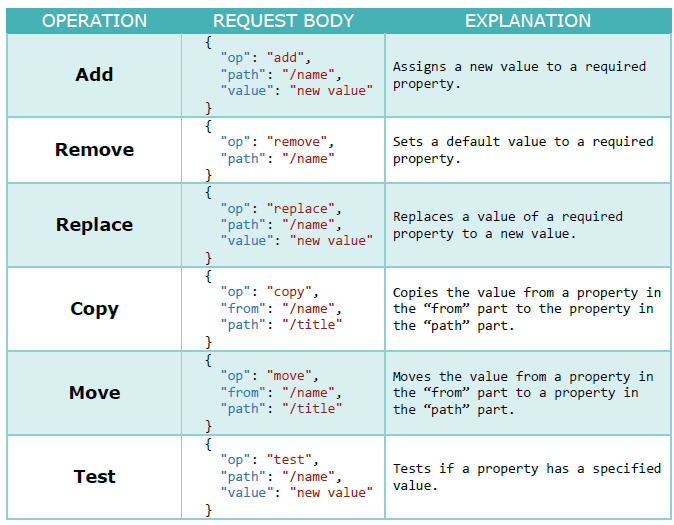


## 18.1 Apply PATCH cho Employee

Trong ứng dụng web API ta cần thêm vào 2 package sau:
```
Microsoft.AspNetCore.JsonPatch
Microsoft.AspNetCore.Mvc.NewtonsoftJson
```

Trong `ConfigureServices` của `Startup.cs` ta cần thêm `AddNewtonsoftJson()` như sau:

Lưu ý là `AddNewtonsoftJson()` phải nằm sau xml và csv mà ta đã add trước đó.

```c#
services.AddControllers(config =>
{
    config.RespectBrowserAcceptHeader = true;
    config.ReturnHttpNotAcceptable = true;
}).AddNewtonsoftJson()
    .AddXmlDataContractSerializerFormatters()
    .AddCustomCSVFormatter();
```
Ta cần mapping từ **Employee** về **EmployeeForUpdateDto** do vậy trong `MappingProfile` ta cần modify lại như sau:

Việc ta gọi `ReverseMap` là dùng để mapping theo 2 chiều.

```c#
CreateMap<EmployeeForUpdateDto, Employee>().ReverseMap();
```

Trong `EmployeesController` ta thêm mới một action `PartiallyUpdateEmployeeForCompany` như sau:

```c#
    [HttpPatch("{id}")]
    public IActionResult PartiallyUpdateEmployeeForCompany(
        Guid companyId, 
        Guid id, 
        [FromBody] JsonPatchDocument<EmployeeForUpdateDto> patchDoc)
    {
        if(patchDoc == null)
        {
            _logger.LogError("patchDoc object sent from client is null.");
            return BadRequest("patchDoc object is null");
        }

        var company = _repository.Company.GetCompany(companyId, trackChanges: false);
        if(company == null)
        {
            _logger.LogInfo($"Company with id: {companyId} doesn't exist in the database.");
            return NotFound();
        }

        var employeeEntity = _repository.Employee.GetEmployee(companyId, id, trackChanges: true);
        if(employeeEntity == null)
        {
            _logger.LogInfo($"Employee with id: {id} doesn't exist in the database.");
            return NotFound();
        }

        var employeeToPatch = _mapper.Map<EmployeeForUpdateDto>(employeeEntity);
        patchDoc.ApplyTo(employeeToPatch);
        _mapper.Map(employeeToPatch, employeeEntity);
        _repository.Save();
        return NoContent();
    }
```

Ta sẽ dùng Postman để kiểm tra lại như sau;

**URL:** `https://localhost:44315/api/companies/51350133-1c7e-45d2-2973-08d9a3608c7f/employees/920d389f-3574-4e7e-5ff0-08d9a3fabb57`

Cập nhật tuổi empoyee lên thành 100.

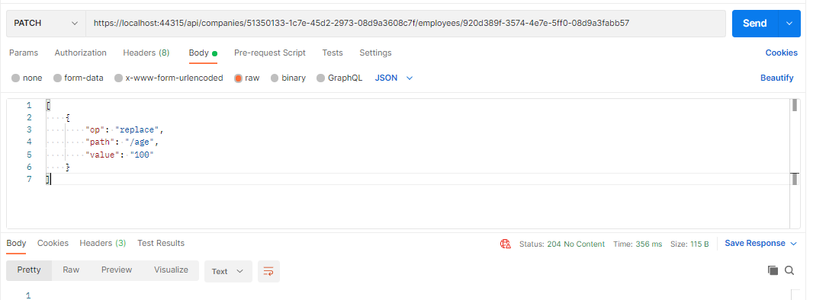

Remove tuổi của nhân viên

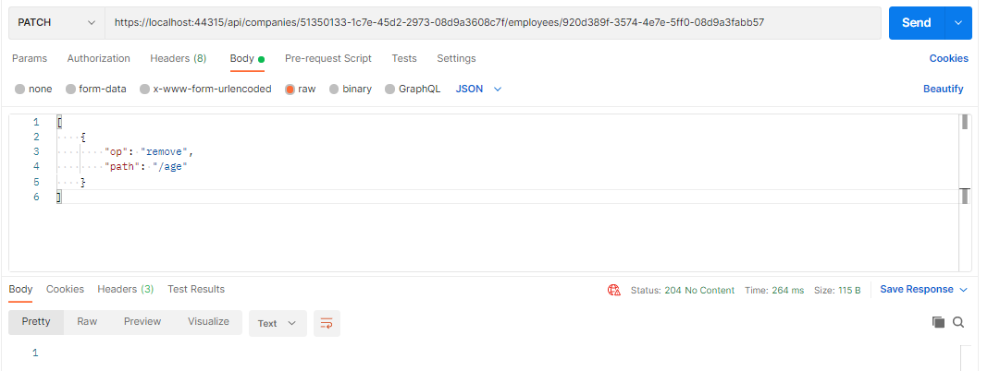


Ta thêm lại tuổi của nhân viên thành 28

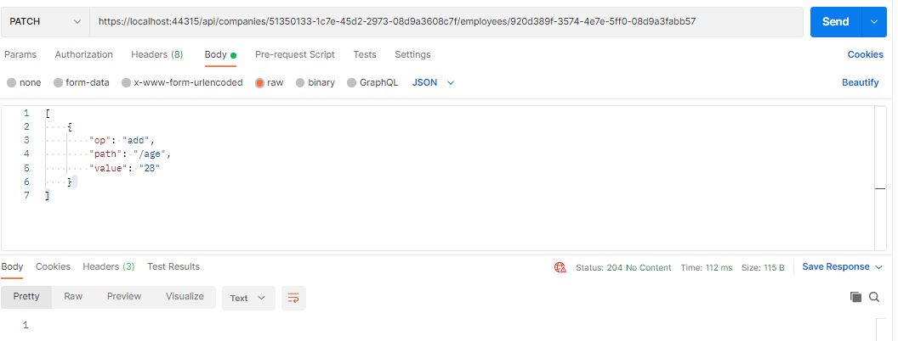


# 19. Validation

## 19.1 Validating khi tạo mới employee.

Thêm validation khi tạo mới employee.

```c#
public class EmployeeForCreationDto
{
    [Required(ErrorMessage="Employee name is a required field.")]
    [MaxLength(30, ErrorMessage = "Maximum length for the name is 30 characters.")]
    public string Name { get; set; }

    [Required(ErrorMessage ="Age is a required field.")]
    public int Age { get; set; }

    [Required(ErrorMessage ="Position is a required field.")]
    [MaxLength(20, ErrorMessage ="Maximum length for the Position is 20 characters.")]
    public string Position { get; set; }
}
```

Khi ta thực hiện tạo mới một employee mà object employee đó không hợp lệ ta sẽ nhận được lỗi như sau:
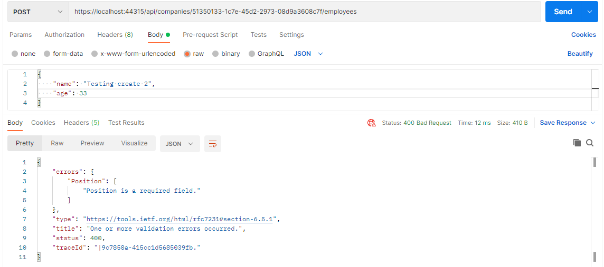

Ở trên ta thấy khi data ta gởi lên không hợp lệ thì server sẽ trả về lỗi **400** nhưng lỗi hợp lý trong trường hợp này nên là **422 Unprocessable Entity**.
Để làm được điều này ta cần làm các việc sau:

Trong phương thức `ConfigureServices` của `Startup.cs` ta thêm dòng code sau;

```c#
services.Configure<ApiBehaviorOptions>(options =>
{
    options.SuppressModelStateInvalidFilter = true;
});
```

Trong `EmployeesController` ta add đoạn code để validate như sau:

```c#
public IActionResult CreateEmployeeForCompany(Guid companyId, [FromBody] EmployeeForCreationDto employee)
{
    if(employee == null)
    {
        _logger.LogError("EmployeeForCreationDto object sent from client is null.");
        return BadRequest("EmployeeForCreationDto object is null");
    }

    if (!ModelState.IsValid)
    {
        _logger.LogError("Invalid model state for the EmployeeForCreationDto object");
        return UnprocessableEntity(ModelState);
    }

    /// the rest of the code ....

}
```

Khi ta thực hiện test API bằng Postman ta sẽ thấy như sau:

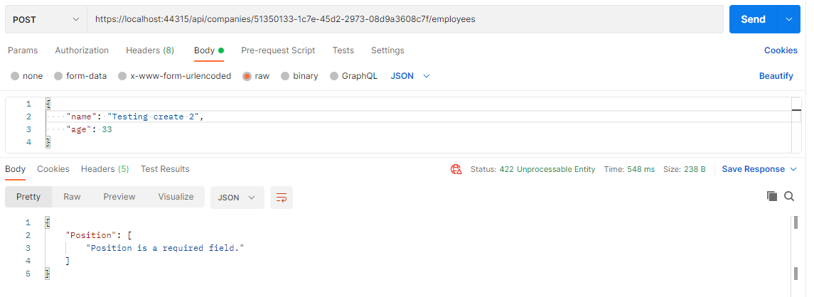

## 19.2 Validating int type

Khi ta tạo mới employee mà không chỉ định age thì sẽ không báo lỗi, vì nó sẽ lấy giá trị mặt định là 0 của kiểu int để gán vào object employee.

Để validate điều đó ta thêm vào `EmployeeForCreatingDto` như sau:

```c#
    [Required(ErrorMessage ="Age is a required field.")]
    [Range(18, int.MaxValue, ErrorMessage ="Age is required and it can't be lower than 18.")]
    public int Age { get; set; }
```

Khi ta dùng Postman ta sẽ thấy kết quả như sau:

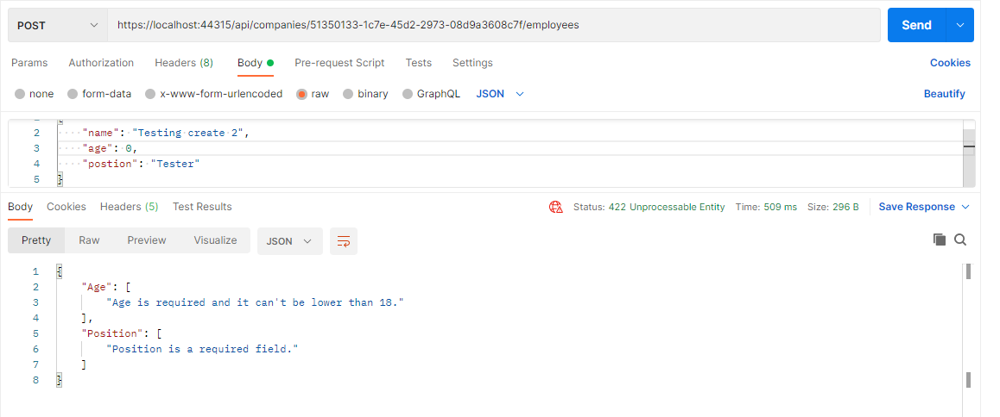

## 19.3 Validation for PUT request.

Nhìn chung thì validation cho PUT và POST thì không khác nhau (ngoài trừ một vài trường hợp).

Ta nhận thấy rằng khi ta thêm các validation data anotation cho DTO **Update** và **Create** sẽ bị trùng nhau, do vậy ta cần làm như sau:

Ta tạo mới một class `EmployeeForManipulationDto`

```c#
public class EmployeeForManipulationDto
{
    [Required(ErrorMessage = "Employee name is a required field.")]
    [MaxLength(30, ErrorMessage = "Maximum length for the name is 30 characters.")]
    public string Name { get; set; }

    
    [Range(18, int.MaxValue, ErrorMessage = "Age is required and it can't be lower than 18.")]
    public int Age { get; set; }

    [Required(ErrorMessage = "Position is a required field.")]
    [MaxLength(20, ErrorMessage = "Maximum length for the Position is 20 characters.")]
    public string Position { get; set; }
}
```

Sau đó `EmployeeForCreationDto` và `EmployeeForUpdateDto` lần lượt sẽ kế thừa từ `EmployeeForManipulationDto` như sau:

```c#
public class EmployeeForCreationDto:EmployeeForManipulationDto
{
}

public class EmployeeForUpdateDto: EmployeeForManipulationDto
{
}
```

Ta thêm validation cho `UpdateEmployeeForCompany` trong `EmployeesController` như sau:

```c#
[HttpPost]
public IActionResult CreateEmployeeForCompany(Guid companyId, [FromBody] EmployeeForCreationDto employee)
{
    if(employee == null)
    {
        _logger.LogError("EmployeeForCreationDto object sent from client is null.");
        return BadRequest("EmployeeForCreationDto object is null");
    }

    if (!ModelState.IsValid)
    {
        _logger.LogError("Invalid model state for the EmployeeForCreationDto object");
        return UnprocessableEntity(ModelState);
    }

   // The rest of the core here....
}
```
Ta dùng Postman để kiểm tra API như sau:

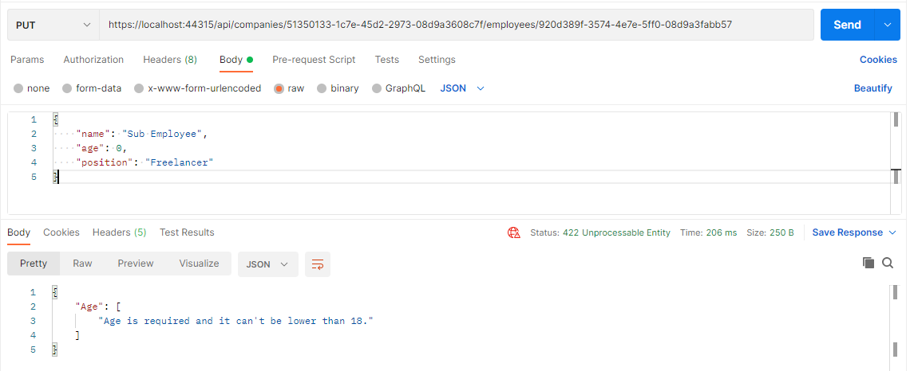


## 19.4 Validation for PATCH request.

Trong `PartiallyUpdateEmployeeForCompany` của  `EmployeesController` ta add lại validation như sau:

```c#
    patchDoc.ApplyTo(employeeToPatch, ModelState);
    TryValidateModel(employeeToPatch);

    if (!ModelState.IsValid)
    {
        _logger.LogError("Invalid model state for the patch document");
        return UnprocessableEntity(ModelState);
    }
```

Lúc này action `PartiallyUpdateEmployeeForCompany` sẽ như sau: 

```c#
 public IActionResult PartiallyUpdateEmployeeForCompany(
            Guid companyId, 
            Guid id, 
            [FromBody] JsonPatchDocument<EmployeeForUpdateDto> patchDoc)
{
    if(patchDoc == null)
    {
        _logger.LogError("patchDoc object sent from client is null.");
        return BadRequest("patchDoc object is null");
    }

    var company = _repository.Company.GetCompany(companyId, trackChanges: false);
    if(company == null)
    {
        _logger.LogInfo($"Company with id: {companyId} doesn't exist in the database.");
        return NotFound();
    }

    var employeeEntity = _repository.Employee.GetEmployee(companyId, id, trackChanges: true);
    if(employeeEntity == null)
    {
        _logger.LogInfo($"Employee with id: {id} doesn't exist in the database.");
        return NotFound();
    }

    var employeeToPatch = _mapper.Map<EmployeeForUpdateDto>(employeeEntity);
    
    patchDoc.ApplyTo(employeeToPatch, ModelState);
    TryValidateModel(employeeToPatch);

    if (!ModelState.IsValid)
    {
        _logger.LogError("Invalid model state for the patch document");
        return UnprocessableEntity(ModelState);
    }

    _mapper.Map(employeeToPatch, employeeEntity);
    _repository.Save();
    return NoContent();
}
```

Ta dùng Postman test lại API như sau:

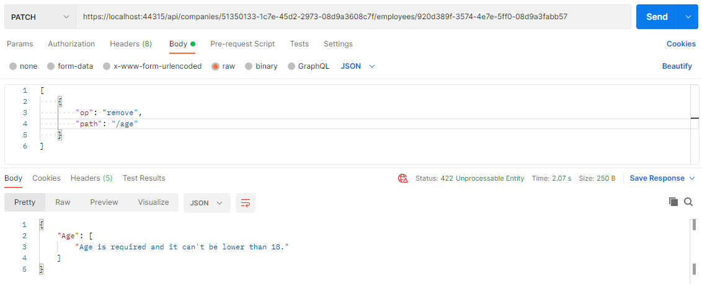

# 20 Asynchronous

Trong asynchronous programming, ta có 3 kiểu trả về:

* `Task<TResult>` cho kiểu trả về có giá trị
* `Task` cho không có kiểu trả về (gần giống với kiểu trả về là `void` trong lập trình đồng bộ)
*  `void` cho một event handler.

**Ví dụ**
Nếu kiểu trả về là `int` thì khi sang lập trình bất đồng bộ sẽ là `Task<int>`
Nếu kiểu trả về là `IEnumerable<string>` thì sẽ là `Task<IEnumerable<string>>`
Nếu kiểu trả về trong lập trình đồng bộ là `void` thì khi sang bất đồng bộ sẽ là `Task`.

Trong lập trình bất đồng bộ ta chỉ trả về là `void` chỉ khi nào đó là một **event handler** vì nó yêu cầu kiểu trả về là `void`, còn lại các trường hợp khác nếu ta không có giá trị trả về thì ta nên luôn luôn phải trả về là một `Task`

## 20.1 `IRepositoryBase` và `RepositoryBase`

Ta sẽ không thêm `async` hay `await` cho các interface và class này, vì ta muốn rằng người dùng những interface hay class này sẽ quyết định là **synchonus** hay **asynchonus** programming.

Đôi khi thì async code có thể chậm hơn là sync code bởi vì EF Core's async commands sẽ mất lâu hơn để thực thi (bởi vì nó cần extra  code để handle threading).

Nhìn chung thì ta nên sử dụng async code khi nào có thể được, nhưng chú ý rằng nếu async code mà chậm hơn sync code thì ta nên về sync code.

## 20.2 Apply asynchronous cho `ICompanyRepository` và `CompanyRepository`

Trong `ICompanyRepository` ta modify lại như sau:

Ta để ý rằng method `Create` và `Delete` ta vẫn để là **Synchonus** code bởi vì:

Đối với hai loại này thì ta không có tạo ra thay đổi ở dưới DB, mà ta chỉ thêm hoặc xóa đối tượng, nói một cách khác entity của ta là thêm trạng thái là **Add* hay **Delte** mà thôi.


```c#
public interface ICompanyRepository
{
	Task<IEnumerable<Company>> GetAllCompaniesAsync(bool trackChanges);
	
	Task<Company> GetCompanyAsync(Guid companyId, bool trackChanges);

	Task<IEnumerable<Company>> GetByIdsAsync(IEnumerable<Guid> ids, bool trackChanges);

	void CreateCompany(Company company);

	void DeleteCompany(Company company);
}
```
Trong `CompanyRepository` ta thay đổi lại như sau:

```c#
public class CompanyRepository : RepositoryBase<Company>, ICompanyRepository
{
	public CompanyRepository(RepositoryContext repositoryContext)
		:base(repositoryContext)
	{
	}

	public async Task<IEnumerable<Company>> GetAllCompaniesAsync(bool trackChanges)
	{
		return await FindAll(trackChanges).OrderBy(c => c.Name).ToListAsync();
	}

	public async Task<Company> GetCompanyAsync(Guid companyId, bool trackChanges)
	{
		return await FindByConditon(c => c.Id.Equals(companyId), trackChanges)
			.SingleOrDefaultAsync();
	}

	public void CreateCompany(Company company)
	{
		Create(company);
	}

	public async Task<IEnumerable<Company>> GetByIdsAsync(IEnumerable<Guid> ids, bool trackChanges)
	{
		return await FindByConditon(x=>ids.Contains(x.Id), trackChanges).ToListAsync();
	}

	public void DeleteCompany(Company company)
	{
		Delete(company);
	}
}
```

## 20.3 Apply asynchronous cho `IRepositoryManager` và `RepositoryManager`

Trong `IRepositoryManager` ta modify lại như sau:

```c#
public interface IRepositoryManager
{
	ICompanyRepository Company { get; }

	IEmployeeRepository Employee { get; }

	Task SaveAsync();
}
```

Trong `RepositoryManager` ta sửa lại method `Save` thành `SaveAsync` như sau:

```c#
public Task SaveAsync()
{
	return _repositoryContext.SaveChangesAsync();
}
```
**Lưu ý**:

Việc ta dùng từ khóa `await` là không bắt buộc, nhưng nếu ta không dùng từ khóa đó thì code của ta sẽ thực thi theo `synchronously`. Điều này thì ta không mong muốn.

## 20.4 Apply asynchronous cho các controllers.

Trong `CompaniesController` ta modify lại như sau:

```c#
    [Route("api/companies")]
    [ApiController]
    public class CompaniesController : ControllerBase
    {
        private readonly IRepositoryManager _repository;
        private readonly IMapper _mapper;
        private readonly ILoggerManager _logger;

        public CompaniesController(IRepositoryManager repository, IMapper mapper, ILoggerManager logger)
        {
            _repository = repository;
            _mapper = mapper;
            _logger = logger;
        }

        [HttpGet]
        public async Task<IActionResult> GetCompanies()
        {
            var companies = await _repository.Company.GetAllCompaniesAsync(trackChanges: false);
            var companiesDto = _mapper.Map<IEnumerable<Company>>(companies);
            return Ok(companiesDto);
        }

        [HttpGet("{id}", Name = "CompanyById")]
        public async Task<IActionResult> GetCompany(Guid id)
        {
            var company = await _repository.Company.GetCompanyAsync(id, trackChanges: false);
            if (company == null)
            {
                _logger.LogInfo($"Company with id: {id} doesn't exist in the database.");
                return NotFound();
            }
            else
            {
                var companyDto = _mapper.Map<Company>(company);
                return Ok(companyDto);
            }
        }

        [HttpPost]
        public async Task<IActionResult> CreateCompany([FromBody] CompanyForCreationDto company)
        {
            if (company == null)
            {
                _logger.LogError("CompanyForCreationDto object sent from client is null.");
                return BadRequest("CompanyForCreationDto object is null");
            }

            var companyEntity = _mapper.Map<Company>(company);
            _repository.Company.CreateCompany(companyEntity);
            await _repository.SaveAsync();

            var companyToReturn = _mapper.Map<CompanyDto>(companyEntity);
            return CreatedAtRoute("CompanyById", new {id = companyToReturn.Id}, companyToReturn);
        }

        [HttpGet("collection/{ids}", Name ="CompanyCollection")]
        public async Task<IActionResult> GetCompanyCollection([ModelBinder(BinderType =typeof(ArrayModelBinder))] IEnumerable<Guid> ids)
        {
            if(ids == null)
            {
                _logger.LogError("Parameter ids is null");
                return BadRequest("Parameter ids is null");
            }

            var companyEntities = await _repository.Company.GetByIdsAsync(ids, trackChanges: false);
            if(ids.Count() != companyEntities.Count())
            {
                _logger.LogError("Some ids are not valid in a collection");
                return NotFound();
            }
            var companiesToReturn = _mapper.Map<IEnumerable<CompanyDto>>(companyEntities);
            return Ok(companiesToReturn);
        }

        [HttpPost("collection")]
        public async Task<IActionResult> CreateCompanyCollection([FromBody]IEnumerable<CompanyForCreationDto> companyCollection)
        {
            if(companyCollection == null)
            {
                _logger.LogError("Company collection sent from client is null.");
                return BadRequest("Company collection is null");
            }

            var companyEntities = _mapper.Map<IEnumerable<Company>>(companyCollection);
            foreach (var company in companyEntities)
            {
                _repository.Company.CreateCompany(company);
            }

            await _repository.SaveAsync();

            var companyCollectionToReturn = _mapper.Map<IEnumerable<CompanyDto>>(companyEntities);
            var ids = string.Join(",", companyCollectionToReturn.Select(c => c.Id));

            return CreatedAtRoute("CompanyCollection", new { ids }, companyCollectionToReturn);
        }

        [HttpDelete("{id}")]
        public async Task<IActionResult> DeleteCompany(Guid id)
        {
            var company = await _repository.Company.GetCompanyAsync(id, trackChanges: false);
            if(company == null)
            {
                _logger.LogInfo($"Company with id: {id} doesn't exist in the database");
                return NotFound();
            }

            _repository.Company.DeleteCompany(company);
            await _repository.SaveAsync();

            return NoContent();
        }

        [HttpPut("{id}")]
        public async Task<IActionResult> UpdateCompany(Guid id, [FromBody] CompanyForUpdateDto company)
        {
            if(company == null)
            {
                _logger.LogError("CompanyForUpdateDto object sent from client is null.");
                return BadRequest("CompanyForUpdateDto object is null");
            }

            var companyEntity = await _repository.Company.GetCompanyAsync(id, trackChanges: true);
            if(companyEntity == null)
            {
                _logger.LogInfo($"Company  with id: {id} doesn't  exist in the database.");
                return NotFound();
            }

            _mapper.Map(company, companyEntity);
            await _repository.SaveAsync();

            return NoContent();
        }
    }
```

# 21. Action filters.
## 21.1 Overview

Trong .NET có các loại filter sau:
* **Authorization filters** - They run first to determine whether a user is authorized for the current request.

* **Resource filters** - They run right after the authorization filters and are very useful for caching and performance.

* **Action filters** - They run right before and after action method execution.

* **Exception filters** - They are used to handle exceptions before the response body is populated.

* **Result filters** - They run before and after the execution of the action methods result.

## 21.2 Create Action filter.

Để tạo mới một Action filter, ta cần tạo mới một class mà nó kế thừa thừa từ `IActionFilter` hoặc `IAsyncActionFilter` hoặc là `ActionFilterAtribute`, vì `ActionFilterAtribute` cũng implement từ `IActionFilter` và `IAsyncActionFilter`.

Khi ta implement cho **Synchronous** Action filter, thì ta phải implement 2 phương thức là `OnActionExecuting` và `OnActionExecuted` như bên dưới:

```C#
namespace ActionFilters.Filters 
{ 
    public class ActionFilterExample : IActionFilter 
    { 
        public void OnActionExecuting(ActionExecutingContext context) 
        { 
            // our code before action executes 
        } 
        public void OnActionExecuted(ActionExecutedContext context) 
        { 
            // our code after action executes 
        } 
    } 
}
```

Khi ta implement cho **asynchronous** action filter thì ta phải kế thừa từ `IAsyncActionFilter` và chỉ cần implement lại method `OnActionExecutionAsync` như sau:

```C#
namespace ActionFilters.Filters 
{ 
    public class AsyncActionFilterExample : IAsyncActionFilter 
    { 
        public async Task OnActionExecutionAsync(ActionExecutingContext context, ActionExecutionDelegate next) 
        { 
            // execute any code before the action executes 
            var result = await next(); 
            // execute any code after the action executes 
        } 
    } 
}
```
## 21. 3 The scope of action filter.

Các scope mà action filter có thể có : **Global, Action, Controller**.

Nếu ta muốn sử dụng action filter mức **global** thì ta cần đăng ký nó trong `AddControllers()` của method `ConfigureServices` của class `Startup.cs`.

```C#
services.AddControllers(config => 
{ 
    config.Filters.Add(new GlobalFilterExample()); 
});
```

Nếu ta muốn dùng action filter như là một service trong Action hay mức Controller, thì ta cần nó đăng ký nó trong `ConfigureServices` như bên trên và thêm vào đó ta cần đăng ký nó vào IoC container như sau:

```c#
services.AddScoped<ActionFilterExample>();
services.AddScoped<ControllerFilterExample>();
```

Khi ta muốn gọi action filter đó ra để sử dụng trong Action hay trong Controller level thì ta đặt nó trên cùng của Controller hay Action như là một ServiceType như sau:

```c#
namespace AspNetCore.Controllers 
{ 
    [ServiceFilter(typeof(ControllerFilterExample))]
    [Route("api/[controller]")] 
    [ApiController] 
    public class TestController : ControllerBase 
    { 
        [HttpGet] 
        [ServiceFilter(typeof(ActionFilterExample))] 
        public IEnumerable<string> Get() 
        { 
            return new string[] { "example", "data" }; 
            } 
    } 
}
```

## 21.4 Thứ tự execute của Action filter (order of infocation).

Ta thấy giống như một middleware, cái nào vào trước nó sẽ được xử lý cuối cùng

*Bắt đầu:* Global filter **=>** Controller filter **=>** Action filter **=>** **Action method execution**

*Kết thúc:* **Action method execution** **=>** Action filter **=>** Controller filter **=>** Global filter

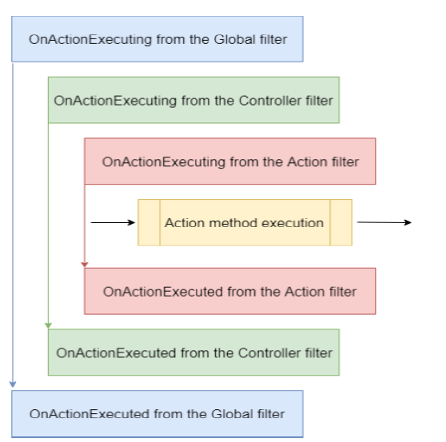

Ta có thể đổi lại thứ tự bằng cách chỉ định `Order` như sau:

Đối với **Controller**

```c#
namespace AspNetCore.Controllers 
{ 
    [ServiceFilter(typeof(ControllerFilterExample), Order = 2)] 
    [Route("api/[controller]")] 
    [ApiController] 
    public class TestController : ControllerBase 
    { 
        [HttpGet] 
        [ServiceFilter(typeof(ActionFilterExample), Order = 1)] 
        public IEnumerable<string> Get() 
        { return new string[] { "example", "data" }; 
        } 
    } 
}
```

Đối với **Action**

```c#
[HttpGet] 
[ServiceFilter(typeof(ActionFilterExample), Order = 2)] 
[ServiceFilter(typeof(ActionFilterExample2), Order = 1)] 
public IEnumerable<string> Get() 
{ 
    return new string[] { "example", "data" }; 
}
```

## 21.4 Thêm action filter cho **Company**.

Ta thấy rằng hiện tại 2 validation sau bị trùng lặp trong `CompaniesController`

Do vậy, ta sẽ tạo một custome action filter để handle 2 thằng này.

```c#
if (company == null)
{
    _logger.LogError("CompanyForCreationDto object sent from client is null.");
    return BadRequest("CompanyForCreationDto object is null");
}

if (!ModelState.IsValid)
{
    _logger.LogError("Invalid model state for the CompanyForCreationDto object");
    return UnprocessableEntity(ModelState);
}
```

Ta tạo mới một action filter tên là `ValidationFilterAttribute` 

```c#
public class ValidationFilterAttribute: IActionFilter
{
    private readonly ILoggerManager _logger;

    public ValidationFilterAttribute(ILoggerManager logger)
    {
        _logger = logger;
    }

    public void OnActionExecuted(ActionExecutedContext context)
    {
        
    }

    public void OnActionExecuting(ActionExecutingContext context)
    {
        var action = context.RouteData.Values["action"];
        var controller = context.RouteData.Values["controller"];

        var param = context.ActionArguments
            .SingleOrDefault(x => x.Value.ToString().Contains("Dto")).Value;
        if(param == null)
        {
            _logger.LogError($"Object sent from client is null. Controller: {controller} , action: {action}");
            context.Result = new BadRequestObjectResult($"Object is null. Controller: {controller}, action: {action}");
            return;
        }

        if (!context.ModelState.IsValid)
        {
            _logger.LogError($"Invalid model state for the object. Controller: {controller}, action: {action}");
            context.Result = new UnprocessableEntityObjectResult(context.ModelState);
        }
    }
}
```

Trong phương thức `ConfigureServices` của `Startup.cs` ta thêm một services sau:

```c#
services.AddScoped<ValidationFilterAttribute>();
```

Trong `CompaniesController` ta thêm `[ServiceFilter(typeof(ValidationFilterAttribute))]` vào hai actions `CreateCompany` và `UpdateCompany` như sau:

```c#
[HttpPost]
[ServiceFilter(typeof(ValidationFilterAttribute))]
public async Task<IActionResult> CreateCompany([FromBody] CompanyForCreationDto company)
{
    // the rest of the code.
}
```

Ta dùng Post man để test lại các cách create/ update một company để kiểm tra kết quả trong trường hợp ta post lên invalid Comany.


## 21.4 Dependency injection in Action filter.

Nếu ta chú ý vào `DeleteCompany` và `UpdateCompany` ta sẽ thấy rằng đoạn code sau kiểm tra Company đó có tồn tại hay không trước khi ta thực hiện các action delete hay update, và đoạn code bên dưới dùng để báo lỗi khi không tìm thấy company với Id được gởi lên để thực hiện action delete hay update.

Trong phần này ta sẽ tạo một action filter để cover việc này tránh việc duplicated code và làm tăng tính tái sử dụng.

```c#
if (company == null)
{
    _logger.LogInfo($"Company with id: {id} doesn't exist in the database");
    return NotFound();
}
```

Ta tạo mới một action filter `ValidateCompanyExistsAttribute` như sau:

```c#
public class ValidateCompanyExistsAttribute : IAsyncActionFilter
{
    private readonly IRepositoryManager _repository;
    private readonly ILoggerManager _logger;

    public ValidateCompanyExistsAttribute(IRepositoryManager repository, ILoggerManager logger)
    {
        _repository = repository;
        _logger = logger;
    }

    public async Task OnActionExecutionAsync(ActionExecutingContext context, ActionExecutionDelegate next)
    {
        var trackChanges = context.HttpContext.Request.Method.Equals("PUT");
        var id = (Guid)context.ActionArguments["id"];
        var company = await _repository.Company.GetCompanyAsync(id, trackChanges);

        if(company == null)
        {
            _logger.LogInfo($"Company with id: {id} doesn't exist in the database.");
            context.Result = new NotFoundResult();
        }
        else
        {
            context.HttpContext.Items.Add("company", company);
            await next();
        }
    }
}
```

Ta chú ý rằng ta đang sử dụng **async** version cho action filter bên trên, bởi vì ta đang lấy dữ liệu từ **async** method `var company = await _repository.Company.GetCompanyAsync(id, trackChanges);`.

Trong đoạn code trên ta chú ý rằng:
* Ta kiểm tra xem có phải là **PUT** request hay không, nếu là **PUT** request thì giá trị cho **trackChanges** sẽ là **true**.

* Nếu giá trị của **Company** là khác `null` ta sẽ gán nó vào trong `HttpContext`để sửa dụng trong các action methods, ta không muốn phải đi query database 2 lần để lấy ra giá trị của **Company**.

**Add action filter cho Company**

Trong method `ConfigureService` của `Startup.cs` ta đăng ký thêm một service sau:

```c#
services.AddScoped<ValidateCompanyExistsAttribute>();
```
Trong `CompaniesController` ta modify lại hai actions `DeleteCompany` và `UpdateCompany` như sau:

Ta thấy rằng giờ đây ta không còn phải xuống DB để get Company lên mà ta lấy ra từ `HttpContext` bằng lệnh sau `var companyEntity = HttpContext.Items["company"] as Company;` bởi vì trong action filter `ValidateCompanyExistsAttribute` ta đã gét `Company` dưới DB để kiểm tra sự tồn tại của nó và sau đó ta gán nó vào `HttpContext` để ta có thể sử dụng ở các action mà đang sử dụng action filter này.

```c#
    [HttpDelete("{id}")]
    [ServiceFilter(typeof(ValidateCompanyExistsAttribute))]
    public async Task<IActionResult> DeleteCompany(Guid id)
    {
        var company = HttpContext.Items["company"] as Company;

        _repository.Company.DeleteCompany(company);
        await _repository.SaveAsync();

        return NoContent();
    }
```
```c#
[HttpPut("{id}")]
[ServiceFilter(typeof(ValidationFilterAttribute))]
[ServiceFilter(typeof(ValidateCompanyExistsAttribute))]
public async Task<IActionResult> UpdateCompany(Guid id, [FromBody] CompanyForUpdateDto company)
{
    var companyEntity = HttpContext.Items["company"] as Company;

    _mapper.Map(company, companyEntity);
    await _repository.SaveAsync();

    return NoContent();
}
```

**Add action filter cho Employee**

Ta tạo mới một class `ValidateEmployeeForCompanyExistsAttribute` như sau:

```c#
public class ValidateEmployeeForCompanyExistsAttribute : IAsyncActionFilter
{
    private readonly IRepositoryManager _repository;
    private readonly ILoggerManager _logger;

    public ValidateEmployeeForCompanyExistsAttribute(IRepositoryManager repository, ILoggerManager logger)
    {
        _repository = repository;
        _logger = logger;
    }

    public async Task OnActionExecutionAsync(ActionExecutingContext context, ActionExecutionDelegate next)
    {
        var method = context.HttpContext.Request.Method;
        var trackChanges = (method.Equals("PUT") || method.Equals("PATCH")) ? true: false;
        var companyId = (Guid)context.ActionArguments["companyId"];
        var company = await _repository.Company.GetCompanyAsync(companyId, false);

        if(company == null)
        {
            _logger.LogInfo($"Company with id: {companyId} doesn't exists in the database.");
            context.Result = new NotFoundResult();
            return;
        }

        var id = (Guid)context.ActionArguments["id"];
        var employee = await _repository.Employee.GetEmployeeAsync(companyId, id, trackChanges);
        if(employee == null)
        {
            _logger.LogInfo($"Employee with id: {id} doesn't exist in the database.");
            context.Result = new NotFoundResult();
        }
        else
        {
            context.HttpContext.Items.Add("employee", employee);
            await next();
        }
    }
}
```
Trong method `ConfigureService` của `Startup.cs` ta đăng ký thêm một service sau:

```c#
services.AddScoped<ValidateEmployeeForCompanyExistsAttribute>();
```

Trong `EmployeesController` ta modify lại hai actions `UpdateEmployeeForCompany`,  `DeleteEmployeeForCompany` và `PartiallyUpdateEmployeeForCompany` như sau:

```c#
[HttpDelete("{id}")]
[ServiceFilter(typeof(ValidateEmployeeForCompanyExistsAttribute))]
public async Task<IActionResult> DeleteEmployeeForCompany(Guid companyId, Guid id)
{
    var employeeForCompany = HttpContext.Items["employee"] as Employee;
    
    _repository.Employee.DeleteEmployee(employeeForCompany);
    await _repository.SaveAsync();

    return NoContent();
}
```

```c#
[HttpPut("{id}")]
[ServiceFilter(typeof(ValidationFilterAttribute))]
[ServiceFilter(typeof(ValidateEmployeeForCompanyExistsAttribute))]
public async Task<IActionResult> UpdateEmployeeForCompany(Guid companyId, Guid id, [FromBody] EmployeeForUpdateDto employee)
{
    var employeeEntity = HttpContext.Items["employee"] as Employee;
    
    _mapper.Map(employee, employeeEntity);
    await _repository.SaveAsync();

    return NoContent();
}
```

```c#
[HttpPatch("{id}")]
[ServiceFilter(typeof(ValidateEmployeeForCompanyExistsAttribute))]
public async Task<IActionResult> PartiallyUpdateEmployeeForCompany(Guid companyId, Guid id, [FromBody] JsonPatchDocument<EmployeeForUpdateDto> patchDoc)
{
    if(patchDoc == null)
    {
        _logger.LogError("patchDoc object sent from client is null.");
        return BadRequest("patchDoc object is null");
    }

    var employeeEntity = HttpContext.Items["employee"] as Employee;

    var employeeToPatch = _mapper.Map<EmployeeForUpdateDto>(employeeEntity);
    
    patchDoc.ApplyTo(employeeToPatch, ModelState);
    TryValidateModel(employeeToPatch);

    if (!ModelState.IsValid)
    {
        _logger.LogError("Invalid model state for the patch document");
        return UnprocessableEntity(ModelState);
    }

    _mapper.Map(employeeToPatch, employeeEntity);
    await _repository.SaveAsync();
    return NoContent();
}
```

# 22. Paging

## 22.1 Paging cho employee


Ta tạo một class `RequestParameters` chứa các properties cho việc paging như sau:

```c#
namespace Entities.RequestFeatures
{
    public class RequestParameters
    {
        const int maxPagesize = 50;
        public int PageNumber { get; set; } = 1;

        private int _pageSize = 10;
        public int PageSize
        {
            get { return _pageSize; }
            set { _pageSize = (value > maxPagesize) ? maxPagesize : value; }
        }

    }

    public class EmployeeParameters: RequestParameters
    {

    }
}
```
Ta modify lại phương thức `GetEmployeesAsync` trong `IEmployeeRepository` như sau:

```c#
Task<IEnumerable<Employee>> GetEmployeesAsync(Guid companyId, EmployeeParameters employeeParameters, bool trackChanges);
```

Ta cũng phải modify lại trong `GetEmployeesAsync` của `EmployeeRepository` như sau:

```c#
public async Task<IEnumerable<Employee>> GetEmployeesAsync(Guid companyId, EmployeeParameters employeeParameters,  bool trackChanges)
{
    return await FindByConditon(e => e.CompanyId.Equals(companyId), trackChanges)
        .OrderBy(e => e.Name)
        .Skip((employeeParameters.PageNumber -1) * employeeParameters.PageSize)
        .Take(employeeParameters.PageSize)
        .ToListAsync();
}
```

Giải thích về cách phần trang và cách lấy đúng phần tử cho một trang

Giả sử mỗi trang của ta gồm 20 phần tử. Vậy nếu ta ở trang 3 có phải là ta phải bỏ số phần tử của trang 1 và trang 2, mà mỗi trang 20 phần tử vậy khi lấy số phần tử ở trang 3 thì ta phải bỏ đi 40 phần tử và lấy phần tử thứ 41 trở đi.

Do vậy ta có cách tính cho việc bỏ bao nhiêu phần tử như sau:

**((Trang_Hiện_Tại -1) * Số_Phần_Tử_Ở_Mỗi_Trang)**

Trong controller `EmployeesController` phương thức `GetEmployeesForCompany` ta sẽ modify lại như sau:

```c#
 public async Task<IActionResult> GetEmployeesForCompany(Guid companyId, [FromQuery]EmployeeParameters employeeParameters)
{
    var company = await _repository.Company.GetCompanyAsync(companyId, trackChanges: false);
    if (company == null)
    {
        _logger.LogInfo($"Company with id: {companyId} doesn't exist in the database.");
        return NotFound();
    }

    var employees = await _repository.Employee.GetEmployeesAsync(companyId, employeeParameters, trackChanges: false);
    var employeesDto = _mapper.Map<IEnumerable<EmployeeDto>>(employees);
    return Ok(employeesDto);
}
```

Ta dùng Postman để kiểm tra sẽ thấy kết quả như sau:

`https://localhost:44315/api/companies/10dbcb08-2ab1-4d8d-068f-08d9a2d14f23/employees?pageNumber=2&pageSize=3`


## 22.1 Improving paging

Trong thư mục **RequestFeatures** ta tạo thêm class `MetaData` như sau: 

Trong đó:
* `HasPrevious` sẽ là true nếu `CurrentPage` lớn hơn `.
* `HasNext` sẽ là true nếu `CurrentPage` nhỏ hơn tổng số trang.
* `TotalPages` được tính dựa vào lấy tổng số phần tử chia cho kích thức số phần tử của một trang, và sẽ được làm tròn lên (ví dụ 2.5 sẽ là 3)

```c#
public class MetaData
{
    public int CurrentPage { get; set; }
    public int TotalPages { get; set; }
    public int PageSize { get; set; }
    public int TotalCount { get; set; }

    public bool HasPrevious => CurrentPage > 1;
    public bool HasNext => CurrentPage < TotalPages;
}
```

và class ` PageList<T>:`

```c#
public class PageList<T>: List<T>
{
    public MetaData MetaData { get; set; }

    public PageList(List<T> items, int count, int pageNumber, int pageSize)
    {
        MetaData = new MetaData
        {
            TotalCount = count,
            PageSize = pageSize,
            CurrentPage = pageNumber,
            TotalPages = (int)Math.Ceiling(count / (double)pageSize)
        };
        AddRange(items);
    }

    public static PageList<T> ToPageList(IEnumerable<T> source, int pageNumber, int pageSize)
    {
        var count = source.Count();
        var items = source
            .Skip((pageNumber - 1) * pageSize)
            .Take(pageSize).ToList();

        return new PageList<T>(items, count, pageNumber, pageSize);
    }
}
```

Trong interface `IEmployeeRepository` ta đổi lại method `GetEmployeesAsync` như sau:

```c#
Task<PageList<Employee>> GetEmployeesAsync(Guid companyId, EmployeeParameters employeeParameters, bool trackChanges);
```

Ta implement laij `GetEmployeesAsync` trong class `EmployeeRepository` như sau:

```c#
public async Task<PageList<Employee>> GetEmployeesAsync(Guid companyId, EmployeeParameters employeeParameters,  bool trackChanges)
{
    var employees = await FindByConditon(e => e.CompanyId.Equals(companyId), trackChanges)
        .OrderBy(e => e.Name).ToListAsync();
    return PageList<Employee>.ToPageList(employees, employeeParameters.PageNumber, employeeParameters.PageSize);
}
```

Trong controller `EmployeesController` ta implement lại action `GetEmployeesForCompany` như sau:

```c#
public async Task<IActionResult> GetEmployeesForCompany(Guid companyId, [FromQuery]EmployeeParameters employeeParameters)
{
    var company = await _repository.Company.GetCompanyAsync(companyId, trackChanges: false);
    if (company == null)
    {
        _logger.LogInfo($"Company with id: {companyId} doesn't exist in the database.");
        return NotFound();
    }

    var employees = await _repository.Employee.GetEmployeesAsync(companyId, employeeParameters, trackChanges: false);

    Response.Headers.Add("X-Pagination", JsonConvert.SerializeObject(employees.MetaData));

    var employeesDto = _mapper.Map<IEnumerable<EmployeeDto>>(employees);
    return Ok(employeesDto);
}
```

Khi ta dùng Postman để test lại, thì ta để ý rằng trong phần header của response trả về sẽ như trong hình.

`https://localhost:44315/api/companies/10dbcb08-2ab1-4d8d-068f-08d9a2d14f23/employees?pageNumber=2&pageSize=6`


# 23 Filtering

Điểm khác biệt giữa filtering và searching.

Ta có thể thấy filtering là các checkbox hay combox, nó sẽ truyền các criteria cụ thể để lọc lại các kết quả phù hợp.

Còn searching là ta truyền một chuỗi text và nó sẽ search all hết, nó có thể là tìm kiếm chính xác hay tìm kiếm tương đối.

Ta sẽ xây dựng các API hỗ trợ các filter như sau:

```
/api/companies/companyId/employees?minAge=26&maxAge=29

/api/companies/companyId/employees?minAge=26

/api/companies/companyId/employees?maxAge=29
```
Trong `RequestParameters` ta implement thêm class `EmployeeParameters` như sau:

```c#
    public class EmployeeParameters: RequestParameters
    {
        public uint MinAge { get; set; }
        public uint MaxAge { get; set; } = int.MaxValue;
        public bool ValidAgeRange => MaxAge > MinAge;
    }
```
Trong `EmployeesController` ta thêm đoạn validation cho `GetEmployeesForCompany` như sau:

```c#
if (!employeeParameters.ValidAgeRange)
{
    return BadRequest("Max age can't be less than min age.");
}
```

Lúc này action `GetEmployeesForCompany` sẽ trông như bên dưới

```c#
public async Task<IActionResult> GetEmployeesForCompany(Guid companyId, [FromQuery] EmployeeParameters employeeParameters)
{
    if (!employeeParameters.ValidAgeRange)
    {
        return BadRequest("Max age can't be less than min age.");
    }

    var company = await _repository.Company.GetCompanyAsync(companyId, trackChanges: false);
    if (company == null)
    {
        _logger.LogInfo($"Company with id: {companyId} doesn't exist in the database.");
        return NotFound();
    }

    var employees = await _repository.Employee.GetEmployeesAsync(companyId, employeeParameters, trackChanges: false);

    Response.Headers.Add("X-Pagination", JsonConvert.SerializeObject(employees.MetaData));

    var employeesDto = _mapper.Map<IEnumerable<EmployeeDto>>(employees);
    return Ok(employeesDto);
}
```

Trong `EmployeeRepository` ta thêm điều kiện filter vào như sau cho method `GetEmployeesAsync` như sau:

```c#
public async Task<PageList<Employee>> GetEmployeesAsync(Guid companyId, EmployeeParameters employeeParameters,  bool trackChanges)
{
    var employees = await FindByConditon(e => e.CompanyId.Equals(companyId) && (e.Age >= employeeParameters.MinAge && e.Age<=employeeParameters.MaxAge), trackChanges)
        .OrderBy(e => e.Name).ToListAsync();

    return PageList<Employee>
        .ToPageList(employees, employeeParameters.PageNumber, employeeParameters.PageSize);
}
```

Ta thực hiện kiểm tra bằng Postman như sau:

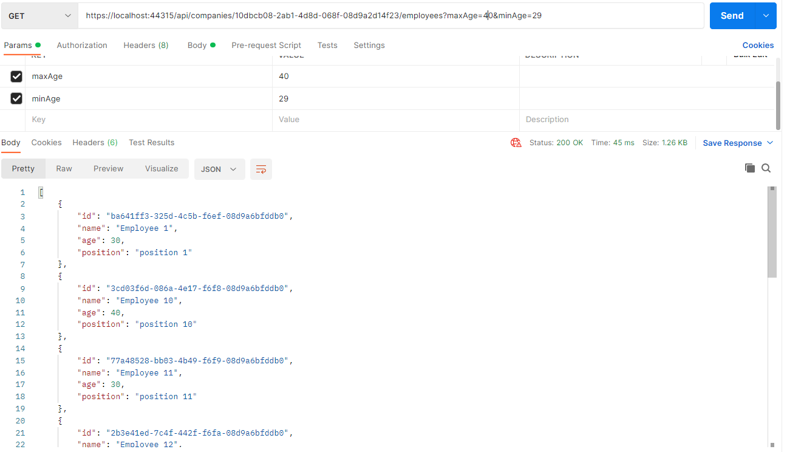


