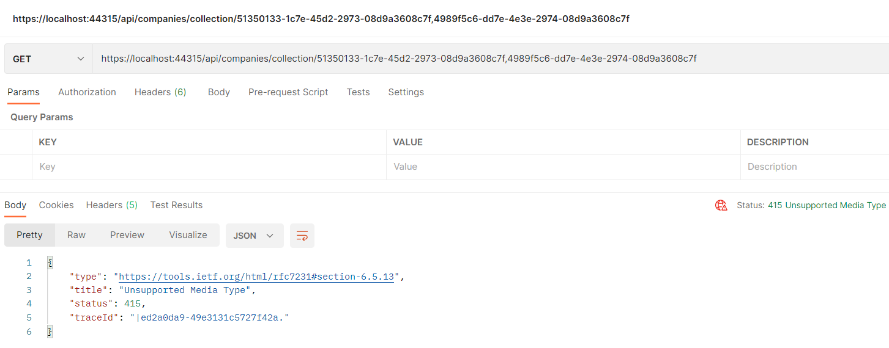

# 1. Tạo `RepositoryBase`

 ## 1.1 Tạo interface `IRepositoryBase<T>`
```c#
public interface IRepositoryBase<T>
{
    IQueryable<T> FindAll(bool trackchanges);
    IQueryable<T> FindByConditon(Expression<Func<T,bool>> expression, bool trackChanges);
    void Create(T entity);
    void Update(T entity);
    void Delete(T entity);
}
```

## 1.2 Implement interface `IRepositoryBase<T>`

```c#
public abstract class RepositoryBase<T> : IRepositoryBase<T> where T : class
{
    protected RepositoryContext RepositoryContext;

    public RepositoryBase(RepositoryContext repositoryContext)
    {
        RepositoryContext = repositoryContext;
    }

    public IQueryable<T> FindAll(bool trackchanges)
    {
        return !trackchanges ? 
            RepositoryContext.Set<T>().AsNoTracking() : 
            RepositoryContext.Set<T>();
    }

    public IQueryable<T> FindByConditon(Expression<Func<T, bool>> expression, bool trackChanges)
    {
        return !trackChanges ? RepositoryContext.Set<T>()
            .Where(expression).AsNoTracking() :
            RepositoryContext.Set<T>()
            .Where(expression);
    }

    public void Create(T entity)
    {
        RepositoryContext.Set<T>().Add(entity);
    }

    public void Delete(T entity)
    {
        RepositoryContext.Set<T>().Remove(entity);
    }
    public void Update(T entity)
    {
        RepositoryContext.Set<T>().Update(entity
    }
}
```

# 2. Tạo các repository mà sử dụng `RepositoryBase`

```c#
public interface ICompanyRepository
{
}

public interface IEmployeeRepository
{
}
```

Tương ứng với các interface ta sẽ có các Implementation sau:

```c#
public class CompanyRepository : RepositoryBase<Company>, ICompanyRepository
{
    public CompanyRepository(RepositoryContext repositoryContext)
        :base(repositoryContext)
    {
    }
}
```

```c#
public EmployeeRepository(RepositoryContext repositoryContext) 
    : base(repositoryContext) 
{ 
}
```

# 3. Tạo Repository Manager.

## interface

```c#
public interface IRepositoryManager
{
    ICompanyRepository Company { get; }
    IEmployeeRepository Employee { get; }
    void Save();
}
```

## Implementation

```c#
public class RepositoryManager : IRepositoryManager
{
    private RepositoryContext _repositoryContext;
    private ICompanyRepository _companyRepository; 
    private IEmployeeRepository _employeeRepository;

    public RepositoryManager(RepositoryContext repositoryContext)
    {
        _repositoryContext = repositoryContext;
    }

    public ICompanyRepository Company
    {
        get
        {
            if (_companyRepository == null) 
                _companyRepository = new CompanyRepository(_repositoryContext); 
            return _companyRepository;
        }
    }

    public IEmployeeRepository Employee
    {
        get
        {
            if (_employeeRepository == null)
                _employeeRepository = new EmployeeRepository(_repositoryContext);
            return _employeeRepository;
        }
    }

    public void Save()
    {
        _repositoryContext.SaveChanges();
    }
}
```

# 4. Tạo extension để đăng ký DI.

Ta tạo một phương thức mở rộng để đăng ký DI cho `RepositoryManager` như sau:

```c#
public static void ConfigureRepositoryManager(this IServiceCollection services)
{
    services.AddScoped<IRepositoryManager, RepositoryManager>();
}
```
Trong method `ConfigureServices` của `Startup.cs` ta đăng ký thêm `services.ConfigureRepositoryManager()` như sau: 

```c#
public void ConfigureServices(IServiceCollection services)
{
    services.AddControllersWithViews();
    services.ConfigureSqlContext(Configuration);
    services.ConfigureRepositoryManager();
}
```

# 5. Implement GET request.

Trong `ICompanyRepository`, thêm phương thức `GetAllCompanies` để get tất các các companies.

```c#
public interface ICompanyRepository
{
    IEnumerable<Company> GetAllCompanies(bool trackchanges);
}
```

Implement `GetAllCompanies` trong `CompanyRepository`

```c#
public class CompanyRepository : RepositoryBase<Company>, ICompanyRepository
{
    public CompanyRepository(RepositoryContext repositoryContext)
        :base(repositoryContext)
    {
    }

    public IEnumerable<Company> GetAllCompanies(bool trackchanges)
    {
        return FindAll(trackchanges).OrderBy(c => c.Name).ToList();
    }
}
```

Trong `CompaniesController` ta implement nhuw sau: 

```c#
[Route("api/companies")]
[ApiController]
public class CompaniesController : ControllerBase
{
    private readonly IRepositoryManager _repository;

    public CompaniesController(IRepositoryManager repository)
    {
        _repository = repository;
    }

    [HttpGet]
    public IActionResult GetCompanies()
    {
        try
        {
            var companies = _repository.Company.GetAllCompanies(trackchanges: false);
            return Ok(companies);
        }
        catch (Exception ex)
        {
            // logging the error here.
            return StatusCode(500, "Internal server error");
        }
    }
}
```

# 6. Adding `CompanyDto`

Thêm mới một `CompanyDto` như sau:
```c#
public class CompanyDto
{
    public Guid Id { get; set; }
    public string Name { get; set; }
    public string FullAddress { get; set; }
}
```

Trong `CompaniesController` ta modify lại `GetCompanies` như sau:

```c#
[HttpGet]
public IActionResult GetCompanies()
{
    try
    {
        var companies = _repository.Company.GetAllCompanies(trackchanges: false);
        var companiesDto = companies.Select(c=> new CompanyDto()
        {
            Id= c.Id,
            Name = c.Name,
            FullAddress = string.Join(' ', c.Address, c.Country)
        }).ToList();

        return Ok(companiesDto);
    }
    catch (Exception ex)
    {
        // logging the error here.
        return StatusCode(500, "Internal server error");
    }
}
```

# 7. Adding Automapper cho `Company` và `CompanyDto`

Trong ứng dụng web application ta cần thêm vào một package mới như sau:

`Install-Package AutoMapper.Extensions.Microsoft.DependencyInjection`

Trong `Startup.cs` ta đăng ký service trong phương thức `ConfigureService` như sau:

```c#
public void ConfigureServices(IServiceCollection services)
{
    services.AddControllersWithViews();
    services.ConfigureSqlContext(Configuration);
    services.ConfigureRepositoryManager();
    services.AddAutoMapper(typeof(Startup));
}
```

Ta thêm mới một class `MappingProfile`, class này phải kế thừ từ `Profile` của Automapper.

```c#
public class MappingProfile:Profile
{
    public MappingProfile()
    {
        CreateMap<Company, CompanyDto>()
            .ForMember(c => c.FullAddress, opt => opt.MapFrom(x => string.Join(' ', x.Address, x.Country)));
    }
}
```
Trong `CompaniesController` việc mapping sẽ như sau:

```c#
[Route("api/companies")]
[ApiController]
public class CompaniesController : ControllerBase
{
    private readonly IRepositoryManager _repository;
    private readonly ILoggerManager _logger;
    private readonly IMapper _mapper;

    public CompaniesController(IRepositoryManager repository, ILoggerManager logger, IMapper mapper)
    {
        _repository = repository;
        _logger = logger;
        _mapper = mapper;
    }

    [HttpGet]
    public IActionResult GetCompanies()
    {
        try
        {
            var companies = _repository.Company.GetAllCompanies(trackchanges: false);
            var companiesDto = _mapper.Map<IEnumerable<Company>>(companies);
            return Ok(companiesDto);
        }
        catch (Exception ex)
        {
            _logger.LogError($"Something went wrong in the {nameof(GetCompanies)} action {ex}");
            return StatusCode(500, "Internal server error");
        }
    }
}
```
# 8. Handing error globally with the build-in Middleware.

Tạo mới một model dùng để thể hiện lỗi.

```c#
public class ErrorDetails
{
    public int StatusCode { get; set; }
    public string Message { get; set; }
    public override string ToString()
    {
        return JsonConvert.SerializeObject(this);
    }
}
```

Tạo mới một extension method `ExceptionMiddlewareExtensions` cho `IApplicationBuilder` như sau:

Lưu ý là ta cần có các dependencies sau trong project chứ extension method này.

```xml
<PackageReference Include="Microsoft.AspNetCore" Version="2.2.0" />
<PackageReference Include="Microsoft.AspNetCore.Http.Abstractions" Version="2.2.0" />
```

```c#
public static class ExceptionMiddlewareExtensions
{
    public static void ConfigureExceptionHandler(this IApplicationBuilder app, ILoggerManager logger)
    {
        app.UseExceptionHandler(appError =>
        {
            appError.Run(async context =>
            {
                context.Response.StatusCode = (int) HttpStatusCode.InternalServerError;
                context.Response.ContentType = "application/json";

                var contextFeature = context.Features.Get<IExceptionHandlerFeature>();
                if (contextFeature != null)
                {
                    logger.LogError($"Error: {contextFeature.Error}");

                    await context.Response.WriteAsync(new ErrorDetails()
                    {
                        StatusCode = context.Response.StatusCode, Message = "Internal Server Error."
                    }.ToString());
                }
            });
        });
    }
}
```

Trong method `Configure` của `Startup.cs` ta cần đăng ký middlware `ConfigureExceptionHandler` mà ta vừa tạo

```c#
public void Configure(IApplicationBuilder app, IWebHostEnvironment env, ILoggerManager logger)
{
    if (env.IsDevelopment())
    {
        app.UseDeveloperExceptionPage();
    }
    else
    {
        app.UseExceptionHandler("/Home/Error");
        app.UseHsts();
    }
    app.ConfigureExceptionHandler(logger);
    app.UseHttpsRedirection();
    app.UseStaticFiles();

    app.UseRouting();

    app.UseAuthorization();

    app.UseEndpoints(endpoints =>
    {
        endpoints.MapControllerRoute(
            name: "default",
            pattern: "{controller=Home}/{action=Index}/{id?}");
    });
}
```

Trong method `GetCompanies` ở controller `CompaniesController` ta modify lại như sau:

```c#
[HttpGet]
public IActionResult GetCompanies()
{
    var companies = _repository.Company.GetAllCompanies(trackchanges: false);
    var companiesDto = _mapper.Map<IEnumerable<Company>>(companies);
    return Ok(companiesDto);
}
```

# 9. Get a single company from database.

Trong interface `ICompanyRepository` ta thêm vào một method như sau: 

```c#
Company GetCompany(Guid companyId, bool trackChanges);
```

Phần implementation trong class `CompanyRepository` ta implement phương thức `GetCompany` của interface `ICompanyRepository` như sau:

```c#
public Company GetCompany(Guid companyId, bool trackChanges)
{
    return FindByConditon(c => c.Id.Equals(companyId), trackChanges)
        .SingleOrDefault();
}
```

Trong `CompaniesController` ta thêm một action dùng để get một company bằng Id

```c#
[HttpGet("{id}")]
public IActionResult GetCompany(Guid id)
{
    var company = _repository.Company.GetCompany(id, trackChanges: false);
    if (company == null)
    {
        _logger.LogInfo($"Company with id: {id} doesn't exist in the database.");
        return NotFound();
    }
    else
    {
        var companyDto = _mapper.Map<Company>(company);
        return Ok(companyDto);
    }
}
```

Ta dùng postman để test thử việc lấy một company bằng một id như sau:
`https://localhost:44315/api/companies/c9d4c053-49b6-410c-bc78-2d54a9991870`

Ta cần chú rằng vì ta đã khai báo `[Route("api/companies")]` bên trên `CompaniesController` nên:

1. `/api/companies` sẽ lấy hết tất cả các company.
2. `/api/companies/c9d4c053-49b6-410c-bc78-2d54a9991870` sẽ lấy company với id mà ta truyền vào

Ta sẽ được kết quả:

```json
{
    "id": "c9d4c053-49b6-410c-bc78-2d54a9991870",
    "name": "Company 1",
    "address": "Street 1",
    "country": "USA",
    "employees": null
}
```
Hoặc như bên dưới khi không có company nào ứng với id ta muốn tìm

```json
{
    "type": "https://tools.ietf.org/html/rfc7231#section-6.5.4",
    "title": "Not Found",
    "status": 404,
    "traceId": "|8e044ef3-45b95bfe02f23ade."
}
```

# 9. Parent/ child relationships in Web API (Get dữ liệu cho employee)

## 9.1 Get all employee từ một CompanyId

Ta thấy thằng một employee luôn luôn thuộc về một company, do vậy phần route của controller nó phải như sau:

```c#
[Route("api/companies/{companyId}/employees")]
```

Trong interface `IEmployeeRepository` ta thêm mới phương thức `GetEmployees` dùng để lấy tất cả employee từ một CompanyId nào đó

```c#
public interface IEmployeeRepository
{
    IEnumerable<Employee> GetEmployees(Guid companyId, bool trackChanges);
}
```
Trong class `EmployeeRepository` ta implement `GetEmployees` như sau:

```c#
public class EmployeeRepository: RepositoryBase<Employee>, IEmployeeRepository
{
    public EmployeeRepository(RepositoryContext repositoryContext) 
        : base(repositoryContext) 
    { 
    }

    public IEnumerable<Employee> GetEmployees(Guid companyId, bool trackChanges)
    {
        return FindByConditon(e => e.CompanyId.Equals(companyId), trackChanges)
            .OrderBy(e => e.Name);
    }
}
```
Trong controller `EmployeesController`

```c#
[Route("api/companies/{companyId}/employees")]
[ApiController]
public class EmployeesController : ControllerBase
{
    private readonly IRepositoryManager _repository;
    private readonly ILoggerManager _logger;
    private readonly IMapper _mapper;

    public EmployeesController(IRepositoryManager repository, ILoggerManager logger, IMapper mapper)
    {
        _repository = repository;
        _logger = logger;
        _mapper = mapper;
    }

    public IActionResult GetEmployeesForCompany(Guid companyId)
    {
        var company = _repository.Company.GetCompany(companyId, trackChanges: false);
        if (company == null)
        {
            _logger.LogInfo($"Company with id: {companyId} doesn't exist in the database.");
            return NotFound();
        }

        var employees = _repository.Employee.GetEmployees(companyId, trackChanges: false);
        return Ok(employees);
    }
}
```
Tạo data transfer object (DTO) cho `Employee` như sau:

Tạo mới `EmployeeDto`

```c#
public class EmployeeDto
{
    public Guid Id { get; set; }
    public string Name { get; set; }
    public int Age { get; set; }
    public string Position { get; set; }
}
```
Trong `MappingProfile` ta thêm mapping giữa `Employee` và `EmployeeDto` như sau:

```c#
CreateMap<Employee, EmployeeDto>();
```

Trong method `GetEmployeesForCompany` của `EmployeesController` trước khi trả data về ta mapping lại kết quả.

```c#
public IActionResult GetEmployeesForCompany(Guid companyId)
{
    var company = _repository.Company.GetCompany(companyId, trackChanges: false);
    if (company == null)
    {
        _logger.LogInfo($"Company with id: {companyId} doesn't exist in the database.");
        return NotFound();
    }

    var employees = _repository.Employee.GetEmployees(companyId, trackChanges: false);
    var employeesDto = _mapper.Map<IEnumerable<EmployeeDto>>(employees);
    return Ok(employeesDto);
}
```

Ta test Api như sau:

```
/api/companies/c9d4c053-49b6-410c-bc78-2d54a9991870/employees
```

Ta sẽ được kết quả

```json
[
    {
    "id": "80abbca8-664d-4b20-b5de-024705497d4a",
    "name": "SD 1",
    "age": 26,
    "position": "SD"
    },
    {
    "id": "86dba8c0-d178-41e7-938c-ed49778fb52a",
    "name": "SD 1",
    "age": 30,
    "position": "SD"
    }
]
```

## 9.2 Get single employee by EmployeeId and CompanyId

Trong `IEmployeeRepository` ta thêm mới một phương thức 

```c#
Employee GetEmployee(Guid companyId, Guid id, bool trackChanges);
```

Trong `EmployeeRepository` ta implement phương thức `GetEmployee`

```c#
public Employee GetEmployee(Guid companyId, Guid id, bool trackChanges)
{
    return FindByConditon(e => e.CompanyId.Equals(companyId) && e.Id.Equals(id), trackChanges)
        .SingleOrDefault();
}
```

Trong `EmployeesController` ta thêm mới một action để get Employee như sau:

```c#
[HttpGet("{id}")]
public IActionResult GetEmployeeForCompany(Guid companyId, Guid id)
{
    var company = _repository.Company.GetCompany(companyId, trackChanges: false);
    if (company == null)
    {
        _logger.LogInfo($"Company with id: {companyId} doesn't exits in the database.");
        return NotFound();
    }

    var employee = _repository.Employee.GetEmployee(companyId, id, trackChanges: false);
    if (employee == null)
    {
        _logger.LogInfo($"Employee with id: {id} doesn't exist in the database.");
        return NotFound();
    }

    var employeeDto = _mapper.Map<EmployeeDto>(employee);
    return Ok(employeeDto);
}
```
Ta thục hiện chạy thử như sau

```
/api/companies/c9d4c053-49b6-410c-bc78-2d54a9991870/employees/86dba8c0-d178-41e7-938c-ed49778fb52a
```

Ta được kết quả sau:

```json
{
    "id": "86dba8c0-d178-41e7-938c-ed49778fb52a",
    "name": "SD 1",
    "age": 30,
    "position": "SD"
}
```
# 10. Configuration data type khi trả về.

## 10.1 Trả về kiểu JSON hoặc XML và không allow media type.

Trong `ConfigureServices` của `Startup.cs` ta thêm một service như sau: 

**Trong đó** 

* `config.RespectBrowserAcceptHeader = true;` chỉ ra rằng ta cho phép client chỉ ra format họ muốn lấy là gì (xml **text/xml** hay json **text/json**) bằng cách truyền vào accept header.

*  `config.ReturnHttpNotAcceptable = true;` chỉ ra rằng server không chấp nhận trả về media type (ví dụ như **"text/css"**). Nếu như client request media type thì sẽ được nhận về **406 Not Acceptable**

```c#
public void ConfigureServices(IServiceCollection services)
{
    services.AddControllers(config =>
    {
        config.RespectBrowserAcceptHeader = true;
        config.ReturnHttpNotAcceptable = true;
    }).AddXmlDataContractSerializerFormatters();
}
```

# 10.2 Trả về một custom format mà ta tự định nghĩa.

Để tạo một custom format ta có thể sử dụng các cách sau:

* Tạo một output formatter class và kế thừa `TextOutputFormatter`.
* Tạo một input formatter class và kế thừa `TextInputformatter`.
* Đăng ký input/ output formatter mà ta tạo bên trên như cách ta làm đối với kiểu XML formatter.

Ta tạo class `CsvOutputFormatter` dùng để trả về định dạng là CSV.

Để sử dụng `TextOutputFormatter` thì project cần có `Microsoft.AspNetCore.Mvc`

```c#
public class CsvOutputFormatter: TextOutputFormatter
{
    public CsvOutputFormatter()
    {
        SupportedMediaTypes.Add(MediaTypeHeaderValue.Parse("text/csv"));
        SupportedEncodings.Add(Encoding.UTF8);
        SupportedEncodings.Add(Encoding.Unicode);
    }

    protected override bool CanWriteType(Type type)
    {
        if (typeof(CompanyDto).IsAssignableFrom(type) || typeof(IEnumerable<CompanyDto>).IsAssignableFrom(type))
        {
            return base.CanWriteType(type);
        }

        return false;
    }

    public override async Task WriteResponseBodyAsync(OutputFormatterWriteContext context, Encoding selectedEncoding)
    {
        var response = context.HttpContext.Response;
        var buffer = new StringBuilder();

        if (context.Object is IEnumerable<CompanyDto>)
        {
            foreach (var company in (IEnumerable<CompanyDto>) context.Object )
            {
                FormatCsv(buffer, company);
            }
        }
        else
        {
            FormatCsv(buffer, (CompanyDto)context.Object);
        }

        await response.WriteAsync(buffer.ToString());
    }

    private static void FormatCsv(StringBuilder buffer, CompanyDto company)
    {
        buffer.AppendLine($"{company.Id},\"{company.Name},\"{company.FullAddress}\"");
    }
}
```
Ta tạo một phương thức mở rộng cho `IMvcBuilder`

```c#
public static IMvcBuilder AddCustomCSVFormatter(this IMvcBuilder builder)
{
    return builder.AddMvcOptions(config => config.OutputFormatters.Add(new CsvOutputFormatter()));
}
```

Trong `ConfigureServices` của `Startup.cs` ta gọi `AddCustomCSVFormatter` để có thể trả về định dạng CSV cho client.

```c#
services.AddControllers(config =>
{
    config.RespectBrowserAcceptHeader = true;
    config.ReturnHttpNotAcceptable = true;
}).AddXmlDataContractSerializerFormatters()
    .AddCustomCSVFormatter();
```

# 11. Tạo mới một Company.

Trong action `GetCompany` ta cần đặt tên cho nó như sau: 

```c#
[HttpGet("{id}", Name = "CompanyById")]
```

Tạo mới `CompanyForCreationDto` để chứa các thuộc tính của một company mới.

```c#
public class CompanyForCreationDto
{
    public string Name { get; set; }
    public string Address { get; set; }
    public string Country { get; set; }
}
```

Trong `MappingProfile` Khai báo việc mapping giữa `CompanyForCreationDto` và `Company` như sau:

```c#
CreateMap<CompanyForCreationDto, Company>();
```


Trong `ICompanyRepository` thêm mới một method sau:

```c#
void CreateCompany(Company company);
```

Implement method trên trong `CompanyRepository`

```c#
public void CreateCompany(Company company)
{
    Create(company);
}
```

Trong `CompaniesController` ta thêm mới một action `CreateCompany` cho việc thêm mới một company.

```c#
[HttpPost]
public IActionResult CreateCompany([FromBody] CompanyForCreationDto company)
{
    if (company == null)
    {
        _logger.LogError("CompanyForCreationDto object sent from client is null.");
        return BadRequest("CompanyForCreationDto object is null");
    }

    var companyEntity = _mapper.Map<Company>(company);
    _repository.Company.CreateCompany(companyEntity);
    _repository.Save();

    var companyToReturn = _mapper.Map<CompanyDto>(companyEntity);
    return CreatedAtRoute("CompanyById", new {id = companyToReturn.Id}, companyToReturn);
}
```

Khi thực thi chương trình ta sẽ được kết quả như sau:


**Lưu ý:**

Ta thấy rằng Id của company ta không cần phải tạo ra vì, việc tạo Id này EF core đã tự tạo cho ta.

Ta thấy trong action `CreateCompany` sẽ có dòng code sau 

`return CreatedAtRoute("CompanyById", new {id = companyToReturn.Id}, companyToReturn);`

Phương thức `CreatedAtRoute` sẽ trả về status code là 201 (create)

**"CompanyById"** chính là route name mà sẽ được tạo ra url trong phần location của header như sau: 


# 12 Tạo mới child resource (Employee)

Ta biết rằng **Employee** là con của **Company** theo một quan hệ nào đó. Vì theo ràng buộc ta chỉ ra là **Employee** phải thuộc về một **Company** .

Tạo `EmployeeForCreationDto` để chứa các giá trị cần được tạo mới cho `Employee`, ta thấy rằng ta không chỉ định ra `CompanyId` vì ta sẽ lấy nó trong route `[Route("api/companies/{companyId}/employees")]` ở controller `EmployeesController`.

```c#
    public class EmployeeForCreationDto
    {
        public string Name { get; set; }
        public int Age { get; set; }
        public string Position { get; set; }
    } 
```
Ta add thêm phương thức `CreateEmployeeForCompany` trong `IEmployeeRepository`

```c#
void CreateEmployeeForCompany(Guid companyId, Employee employee);
```

Phần implementation của `CreateEmployeeForCompany` trong `EmployeeRepository` như sau:

```c#
public void CreateEmployeeForCompany(Guid companyId, Employee employee)
{
    employee.CompanyId = companyId;
    Create(employee);
}
```

Trong `MappingProfile` ta cần khai báo việc mapping giữa `EmployeeForCreationDto` và `Employee`

```c#
CreateMap<EmployeeForCreationDto, Employee>();
```

Trong controller của `EmployeesController`, ta cần thêm `Name ="GetEmployeeForCompany"` vào action `GetEmployeeForCompany` như sau:

```c#
[HttpGet("{id}", Name ="GetEmployeeForCompany")]
```

Ta tạo mới một action `CreateEmployeeForCompany` để tạo mới Employee như sau:

```c#
[HttpPost]
public IActionResult CreateEmployeeForCompany(Guid companyId, [FromBody] EmployeeForCreationDto employee)
{
    if(employee == null)
    {
        _logger.LogError("EmployeeForCreationDto object sent from client is null.");
        return BadRequest("EmployeeForCreationDto object is null");
    }

    var company = _repository.Company.GetCompany(companyId, trackChanges: false);
    if(company == null)
    {
        _logger.LogInfo($"Company with id: {companyId} doesn't exist in the database.");
        return NotFound();
    }

    var employeeEntity = _mapper.Map<Employee>(employee);
    _repository.Employee.CreateEmployeeForCompany(companyId, employeeEntity);
    _repository.Save();

    var employeeToReturn = _mapper.Map<EmployeeDto>(employeeEntity);

    return CreatedAtRoute("GetEmployeeForCompany", new { companyId, id = employeeToReturn.Id }, employeeToReturn);
}
```

Cuối cùng ta tạo một Employee như sau:

`https://localhost:5001/api/companies/53a1237a-3ed3-4462-b9f0-5a7bb1056a33/employees`


Khi ta mở header tab của request ta mới gởi lên để tạo mới một Employee, ta sẽ thấy link để get employee đó.
Nếu ta get bằng link đó sẽ lấy về được employee mà ta vừa tạo ra.


# 13  Tạo mới Company với list các employee (Creating children resources together with a parent)

Trong phần này ta sẽ tạo mới một **company** với một danh sách các employees.

Ta cần thêm một property ` public IEnumerable<EmployeeForCreationDto> Employees { get; set; }` cho `CompanyForCreationDto` như sau:

```c#
    public class CompanyForCreationDto
    {
        public string Name { get; set; }
        public string Address { get; set; }
        public string Country { get; set; }
        public IEnumerable<EmployeeForCreationDto> Employees { get; set; }
    }
```
Tất cả chỉ có vậy, ta tiến hành test như sau:


Ta kiểm tra phần header giá trị Location khi trả về sẽ là một URL mà ta dùng để get thông tin của company mà ta vừa tạo.


Từ URL trả về ta thêm `/employees` để lấy danh sách các employees mà ta vừa tạo


# 14. Tạo mới một list company ( Create a collection of resource)

Trong phần này ta sẽ implement để có thể tạo một danh sách các company mà từ client gởi lên.

Trong `ICompanyRepository` ta thêm vào một phương thức

```c#
IEnumerable<Company> GetByIds(IEnumerable<Guid> ids, bool trackChanges);
```

Ta sẽ implement phương thức này trong `CompanyRepository` như sau:

```c#
public IEnumerable<Company> GetByIds(IEnumerable<Guid> ids, bool trackChanges)
{
    return FindByConditon(x=>ids.Contains(x.Id), trackChanges).ToList();
}
```

Trong `CompaniesController` ta tạo ra 2 actions như sau:

Action `GetCompanyCollection` dùng để lấy về một danh sách các company từ một danh sách các CompanyId.

```c#
[HttpGet("collection/{ids}", Name ="CompanyCollection")]
public IActionResult GetCompanyCollection(IEnumerable<Guid> ids)
{
    if(ids == null)
    {
        _logger.LogError("Parameter ids is null");
        return BadRequest("Parameter ids is null");
    }

    var companyEntities = _repository.Company.GetByIds(ids, trackChanges: false);
    if(ids.Count() != companyEntities.Count())
    {
        _logger.LogError("Some ids are not valid in a collection");
        return NotFound();
    }
    var companiesToReturn = _mapper.Map<IEnumerable<CompanyDto>>(companyEntities);
    return Ok(companiesToReturn);
}
```

Action `CreateCompanyCollection` dùng để tạo ra các Company từ danh sách các company mà client gởi lên.

```c#
[HttpPost("collection")]
public IActionResult CreateCompanyCollection([FromBody]IEnumerable<CompanyForCreationDto> companyCollection)
{
    if(companyCollection == null)
    {
        _logger.LogError("Company collection sent from client is null.");
        return BadRequest("Company collection is null");
    }

    var companyEntities = _mapper.Map<IEnumerable<Company>>(companyCollection);
    foreach (var company in companyEntities)
    {
        _repository.Company.CreateCompany(company);
    }

    _repository.Save();

    var companyCollectionToReturn = _mapper.Map<IEnumerable<CompanyDto>>(companyEntities);
    var ids = string.Join(",", companyCollectionToReturn.Select(c => c.Id));

    return CreatedAtRoute("CompanyCollection", new { ids }, companyCollectionToReturn);
}
```

Ta thực hiện test API ta vừa mới tạo như sau:

**URL:** `https://localhost:44315/api/companies/collection`


**Lưu ý:**

Khi ta bật qua tab header, ta sẽ thấy Location được trả về là một list các Ids của các Company đã được tạo.

`https://localhost:44315/api/companies/collection/51350133-1c7e-45d2-2973-08d9a3608c7f,4989f5c6-dd7e-4e3e-2974-08d9a3608c7f`

Nếu ta dùng **URL** này lúc này sẽ nhận báo lỗi, do vậy mà cần implment **Model binding** cho nó.




# 15. Model binding in API

Ta tạo một class tên là `ArrayModelBinder`, class này sẽ kế thừa từ interface `IModelBinder` và ta sẽ override lại phương thức `BindModelAsync` của interface này như sau:

```c#
public class ArrayModelBinder : IModelBinder
{
    public Task BindModelAsync(ModelBindingContext bindingContext)
    {
        if (!bindingContext.ModelMetadata.IsEnumerableType)
        {
            bindingContext.Result = ModelBindingResult.Failed();
            return Task.CompletedTask;
        }

        var providedValue = bindingContext.ValueProvider
            .GetValue(bindingContext.ModelName).ToString();
        if (string.IsNullOrEmpty(providedValue))
        {
            bindingContext.Result = ModelBindingResult.Success(null);
            return Task.CompletedTask;
        }

        var genericType = bindingContext.ModelType.GetTypeInfo().GenericTypeArguments[0];
        var converter = TypeDescriptor.GetConverter(genericType);

        var objectArray = providedValue.Split(new[] { "," }, StringSplitOptions.RemoveEmptyEntries)
            .Select(x => converter.ConvertFromString(x.Trim())).ToArray();

        var guidArray = Array.CreateInstance(genericType, objectArray.Length);
        objectArray.CopyTo(guidArray, 0);
        bindingContext.Model = guidArray;

        bindingContext.Result = ModelBindingResult.Success(bindingContext.Model);
        return Task.CompletedTask;
    }
}
```

Trong `CompaniesController` ta sẽ modify lại action `GetCompanyCollection` như sau:

```c#
[HttpGet("collection/{ids}", Name ="CompanyCollection")]
public IActionResult GetCompanyCollection([ModelBinder(BinderType =typeof(ArrayModelBinder))] IEnumerable<Guid> ids)
```

Ta chạy thử và kiểm tra lại API

`https://localhost:44315/api/companies/collection/c2dbe813-f405-4856-4336-08d9a38cfd31,d6d551ed-0a5f-430b-4337-08d9a38cfd31`

Ta sẽ thấy kết quả như sau:


# 16. Làm việc với DELETE request.

## 16.1 Delete một Employee

Trong `IEmployeeRepository` ta thêm một phương thức mới

```c#
void DeleteEmployee(Employee employee);
```

Ta implement phương thức `DeleteEmployee` trong `EmployeeRepository` như sau:

```c#
public void DeleteEmployee(Employee employee)
{
    Delete(employee);
}
```

Trong `EmployeesController` ta implement thêm một action `DeleteEmployeeForCompany` dùng để delete một Employee của một Company.

```c#
[HttpDelete("{id}")]
public IActionResult DeleteEmployeeForCompany(Guid companyId, Guid id)
{
    var company = _repository.Company.GetCompany(companyId, trackChanges: false);
    if (company == null)
    {
        _logger.LogInfo($"Company with id: {companyId} doesn't exist in the database.");
        return NotFound();
    }

    var employeeForCompany = _repository.Employee.GetEmployee(companyId, id, trackChanges: false);
    if (employeeForCompany == null)
    {
        _logger.LogInfo($"Employee with id: {id} doen'st exist in the database.");
        return NotFound();
    }

    _repository.Employee.DeleteEmployee(employeeForCompany);
    _repository.Save();

    return NoContent();
}
```

Ta dùng Postman để delete 1 Employee của 1 Company như sau:


Khi ta get lại Employee đó ta sẽ không thấy employee đó nữa.


## 16.2 Delete tất cả các Employee khi delete company của chúng

Trong EF Core theo mặc định khi ta add migration thì sẽ là `DeleteBehavior.Cascade`. Nghĩa là khi ta delete thằng cha thì các thằng của của thằng cha đó sẽ được xóa theo luôn để bảo đảm consistancy. Nên ta chỉ cần handle làm thể nào để delete thằng parent thôi.

Bên dưới là đoạn code khi ta add migration, thì mặc định sẽ là `DeleteBehavior.Cascade`

```c#
modelBuilder.Entity("Entities.Models.Employee", b =>
                {
                    b.HasOne("Entities.Models.Company", "Company")
                        .WithMany("Employees")
                        .HasForeignKey("CompanyId")
                        .OnDelete(DeleteBehavior.Cascade)
                        .IsRequired();

                    b.Navigation("Company");
                });
```
Trong `ICompanyRepository` ta thêm mới một phương thức `DeleteCompany`

```c#
void DeleteCompany(Company company);
```
Ta implement phương thức này trong `CompanyRepository` như sau:

```c#
public void DeleteCompany(Company company)
{
    Delete(company);
}
```

Trong `CompaniesController` ta tạo mới một action `DeleteCompany` dùng để nhận request delete một **Company**

```c#
[HttpDelete("{id}")]
public IActionResult DeleteCompany(Guid id)
{
    var company = _repository.Company.GetCompany(id, trackChanges: false);
    if(company == null)
    {
        _logger.LogInfo($"Company with id: {id} doesn't exist in the database");
        return NotFound();
    }

    _repository.Company.DeleteCompany(company);
    _repository.Save();

    return NoContent();
}
```

Ta dùng postman để test xóa một Company như sau:


# 17. Làm việc với PUT Request.

## 17.1  Cập nhật Employee.

Ta tạo mới DTO `EmployeeForUpdateDto`

```c#
public class EmployeeForUpdateDto
{
    public string Name { get; set; }
    public int Age { get; set; }
    public string Position { get; set; }
}
```

Trong `MappingProfile` thực hiện mapping giữa `EmployeeForUpdateDt` và `Employee`

```c#
CreateMap<EmployeeForUpdateDto, Employee>();
```

Trong `EmployeesController` ta thêm một action `` để thực hiện cập nhật một **Employee**

```c#
[HttpPut("{id}")]
public IActionResult UpdateEmployeeForCompany(Guid companyId, Guid id, [FromBody] EmployeeForUpdateDto employee)
{
    if(employee == null)
    {
        _logger.LogError("EmployeeForUpdateDto object sent from client is null.");
        return BadRequest("EmployeeForUpdateDto object is null");
    }

    var company = _repository.Company.GetCompany(companyId, trackChanges: false);
    if(company == null)
    {
        _logger.LogInfo($"Company with id: {companyId} doesn't exist in the database.");
        return NotFound();
    }

    var employeeEntity = _repository.Employee.GetEmployee(companyId, id, trackChanges: true);
    if(employee == null)
    {
        _logger.LogInfo($"Employee with id: {id} doesn't exist in the database.");
        return NotFound();
    }

    _mapper.Map(employee, employeeEntity);
    _repository.Save();

    return NoContent();
    }
```
Ta dùng Postman để kiểm tra như sau:


**Lưu ý**

Ta thấy rằng EF Core sẽ generate cho ta một câu lệnh sql như bên dưới trong màn hình **Output**

Để hiển thị được như vầy, ta cần thêm vào phần Logging của **appsettings.json** dòng `"Microsoft.EntityFrameworkCore": "Information"` như bên dưới

```json
"Logging": {
    "LogLevel": {
      "Default": "Information",
      "Microsoft": "Warning",
      "Microsoft.Hosting.Lifetime": "Information",
      "Microsoft.EntityFrameworkCore": "Information"

    }
```

```
    Microsoft.EntityFrameworkCore.Database.Command: Information: Executed DbCommand (4ms) [Parameters=[@__companyId_0='?' (DbType = Guid), @__id_1='?' (DbType = Guid)], CommandType='Text', CommandTimeout='30']
    SELECT TOP(2) [e].[EmployeeId], [e].[Age], [e].[CompanyId], [e].[Name], [e].[Position]
    FROM [Employees] AS [e]
    WHERE ([e].[CompanyId] = @__companyId_0) AND ([e].[EmployeeId] = @__id_1)
    Microsoft.EntityFrameworkCore.Database.Command: Information: Executed DbCommand (5ms) [Parameters=[@p2='?' (DbType = Guid), @p0='?' (DbType = Int32), @p1='?' (Size = 30)], CommandType='Text', CommandTimeout='30']
    SET NOCOUNT ON;
    UPDATE [Employees] SET [Age] = @p0, [Name] = @p1
    WHERE [EmployeeId] = @p2;
    SELECT @@ROWCOUNT;
```

**Lưu ý**

Ta thấy rằng ta thực hiện việc update bên trên là ta gọi đến phương tức `Save` để cập nhật. Khi ta **PUT** từ client lên ta phải chỉ ra hết tất cả các thuộc tính khác của đối tượng để cập nhật. Nếu ta không chỉ định hết mà chỉ giá trị được update thì các giá trị không chỉ định sẽ nhận giá trị mặt định của nó. Nghĩ là ta có 3 property của một object mà chỉ có 1 property được cập nhật thì ta cũng phải chỉ ra 2 giá trị của các property không được cập nhật.

Ta thấy rằng trong `RepositoryBase` ta có phương thức **Update** nhưng ta lại không sử dụng vì
* Ở ngữ cảnh hiện tại ta đang ở trong một **connected update** (nghĩa là cùng một conext fetch và update của đối tượng đó).
* Nhưng đôi khi ta sẽ thực hiện một đối tượng mà ngữ cảnh fetch và update khác nhau, ví dụ như ta nhận một object từ một client hay một API nào đó gởi cho ta. Thì việc ta cần làm là nói với EF Core là **track change** đối tượng đó và set **state** của nó là **modified**. **Cả hai actions này ta điều làm được khi dùng method **Update** trong **RepositoryBase**.

Một điều lưu ý là khi ta dùng phương thức **Update** thì tất cả các fields sẽ được update, nghĩa là câu lệnh SQL do EF Core tạo ra sẽ update all field của đói tượng đó.


## 17.2 Inserting resources while updating one.

EF Core cho phép ta thêm mới các child giá trị trong khi ta update parent của nó.

Ta thêm mới `CompanyForUpdateDto`

```c#
public class CompanyForUpdateDto
{
    public string Name { get; set; }
    public string Address { get; set; }
    public string Country { get; set; }
    public IEnumerable<EmployeeForCreationDto> Employees { get; set; }
}
```
Trong **MappingProfile** thực hiện mapping giữa `CompanyForUpdateDto` và `Company`

```c#
 CreateMap<CompanyForUpdateDto, Company>();
```

Trong `CompaniesController` thêm mới một action `UpdateCompany`

```c#
[HttpPut("{id}")]
public IActionResult UpdateCompany(Guid id, [FromBody] CompanyForUpdateDto company)
{
    if(company == null)
    {
        _logger.LogError("CompanyForUpdateDto object sent from client is null.");
        return BadRequest("CompanyForUpdateDto object is null");
    }

    var companyEntity = _repository.Company.GetCompany(id, trackChanges: true);
    if(companyEntity == null)
    {
        _logger.LogInfo($"Company  with id: {id} doesn't  exist in the database.");
        return NotFound();
    }

    _mapper.Map(company, companyEntity);
    _repository.Save();

    return NoContent();
}
```

Thực hiện test API bằng Postman


