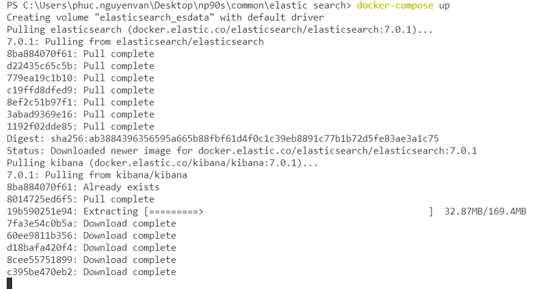

- Khởi chạy môi trường bằng cách vào chạy lệnh `docker-compose up` máy sẽ tự động kéo các image của elastic và kibana về nếu chưa có trên máy của bạn

- Ta có thể sử dụng lệnh `curl -X GET localhost:9200` để kiểm tra hoặc có thể truy cập trực tiếp từ trình duyệt web bằng cổng `localhost:5601` để kiểm tra.
